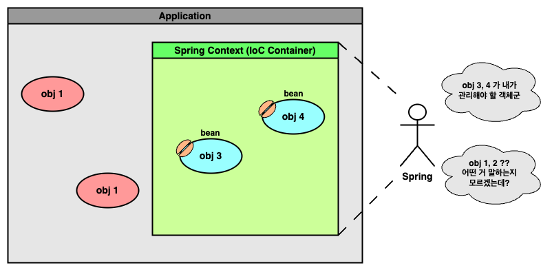
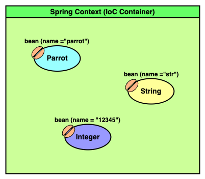
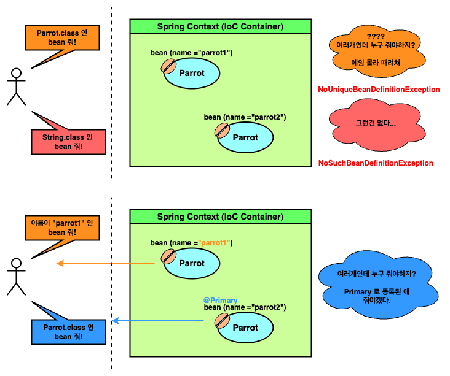

# Chapter 2 : The Spring context : Defining beans

---

2 장은 스프링 *context* 와 *bean* 을 소개하며 이들이 왜 중요한지, 그리고 어떻게 사용할 수 있는지 설명한다.

---

## 스프링 Context 와 Bean

개발자가 코드로 집적 개체를 생성, 통제하는 행위는 종종 버그를 일으킬 수 있다.
또한 이는 boilerplate 코드가 많아지고, 개발 비용이 높아지는 상황까지 이를 수 있다.

스프링은 이를 **_제어의 역전 (IoC, Inversion of Control)_** 을 통해 해결한다. 프레임웍이 개체를 통제함으로서 개발자의 의무를 줄이고, 많은 boilerplate 코드를 줄일 수 있다.

하지만 스프링이 주도권을 갖기 위해선 필수적인 요소가 존재하는데, 바로 **_Context_** 와 **_Bean_** 이다.

스프링 context 를 쉽게 말해 구동되는 앱 메모리에 존재한 어느 공간으로, 스프링이 관리할 개체들이 존재하는 공간이다.

<!-- spring_context_and_bean.png -->

<p align="center">
  
</p>

스프링에는 다양한 context 들이 존재한다. 하지만 **_스프링 context_** 라 하면 대개 **_Application Context_** 를 뜻하고, 이는 **_IoC Container_** 라 불리기도
한다.

기본적으로 스프링은 우리 앱에 존재하는 개체들을 인식할 수 없다. 하지만 인식할 수 있도록 context 에 넣어주고, 그 개체들의 제어를 스프링에게 위윔하는 것이다.

또한 이 때 스프링 context 에 등록된 개체를 bean 이라 부른다.

---

## Context 에 Bean 을 등록하는 2 가지 방법

결국 스프링은 context 에 등록된 개체를 사용하며 프레임웍의 다양한 기능들을 제공한다.
하지만 이는 context 에 개체를 등록시켜야만 가능하다.

context 에 bean 을 등록하는 방법은 크게 2 가지 방법이 있는데, `@Bean` 어노테이션을 이용하는 방법과, **_스테레오타입 (Stereotype)_** 어노테이션을 이용하는 방법이다.

---

### I. `@Bean` 어노테이션 이용하기

`@Bean` 어노테이션을 이용하기 위해선 `@Configuration` 이 붙은 _'스프링 설정 클래스'_ 가 필요하다.

```java
import org.springframework.context.annotation.Configuration;

/*
Indicates that a class declares one or more @Bean methods
and may be processed by the Spring container to generate bean definitions
and service requests for those beans at runtime,
*/
@Configuration
public class Config {
}
```

`@Configuration` 은 `org.springframework.context.annotation` 패키지에 존재하며, 주석의 말대로 `@Bean` 이 붙은 메서드를 구현하여 context 에 등록할 bean 정의 _(bean definition)_ 를 생성할 수 있다.

```java
import org.springframework.context.annotation.Bean;

@Configuration
public class Config {

  /*
  Indicates that a method produces a bean to be managed 
  by the Spring container.
   */
  @Bean
  Parrot parrot() {
    Parrot p = new Parrot();
    p.setName("I am a Parrot!!!");
    return p;
  }

  @Bean
  String str() {
    return "I am Str!!!";
  }

  @Bean(name = "12345")
  Integer integer() {
    return 12345;
  }
}
```

위 설정 클래스를 보면 `Parrot`, `String`, `Integer` 타입의 bean 을 선언한 것을 볼 수 있다.

따라서 결국 context 에 위 3 bean 들이 등록되는데, **이 때 bean 들의 이름은 명시적으로 설정하지 않는 이상 메서드의 이름이 붙는다.**

<!-- spring_bean_annot_1.png -->

<p align="center">
  
</p>

잠시 `@Bean` 어노테이션을 더 자세히 들여다보면, 아래처럼 `name`, `value` 가 동일한 값임을 알 수 있다.

```java
import org.springframework.core.annotation.AliasFor;

@Target({ElementType.METHOD, ElementType.ANNOTATION_TYPE})
@Retention(RetentionPolicy.RUNTIME)
@Documented
public @interface Bean {

	@AliasFor("name")
	String[] value() default {};

	@AliasFor("value")
	String[] name() default {};

	boolean autowireCandidate() default true;

	String initMethod() default "";

	String destroyMethod() default AbstractBeanDefinition.INFER_METHOD;

}
```

또한 이들 모두 `String[]` 로, 하나의 bean 이 여러개의 이름을 가질 수 있다.

결국 우리는 스프링 설정 클래스 `Config` 에 어떤 개체가 bean 이 되어야 하는지 명시하였다. 이제 이 `Config` 클래스를 이용해 context 에 bean 을 적재할 수 있다.

```java
var context
        /*
        Create a new AnnotationConfigApplicationContext,
        deriving bean definitions from the given component classes
        and automatically refreshing the context.
         */
        = new AnnotationConfigApplicationContext(Config.class);

/*
Return the bean instance that uniquely matches the given object type, if any.
*/
Parrot p = context.getBean(Parrot.class);
String str = (String) context.getBean("str");
Integer i = context.getBean("12345", Integer.class);

for (Object bean : Arrays.asList(p, str, i))
        System.out.println(bean.getClass().getSimpleName() + "\t: " + bean);
```
```
Parrot	: I am Parrot!!!
String	: I am Str!!!
Integer	: 12345
```

위 예시처럼 등록된 bean 의 타입 (`Parrot.class`, `Integer.class`), bean 의 이름 (`"str"`), 혹은 이들 모두를 이용 (`"12345", Integer.class`) 해 context 에서 bean 을 제공받을 수 있다.

하지만 만약 context 에 찾는 bean 이 없거나 찾은 bean 이 여러개라면 에러가 발생한다.

```java
@Configuration
public class Config {
    @Bean
    Parrot parrot1()    {
        Parrot p = new Parrot();
        p.setName("I am First Parrot!!!");
        return p;
    }

    @Bean
    Parrot parrot2()    {
        Parrot p = new Parrot();
        p.setName("I am Second Parrot!!!");
        return p;
    }
}
```
```java
Parrot p = context.getBean(Parrot.class);
// org.springframework.beans.factory.NoUniqueBeanDefinitionException
// No qualifying bean of type 'practice.using_beans.Parrot' available:
// expected single matching bean but found 2: parrot1,parrot2

String str = context.getBean(String.class);
// org.springframework.beans.factory.NoSuchBeanDefinitionException
// No qualifying bean of type 'java.lang.String' available
```

<!-- spring_bean_annot_2.png -->

<p align="center">
  
</p>

이러한 상황은 bean 이름 혹은 `@Qualifer` 어노테이션을 사용해, 어느 bean 인지 명확하게 지칭해 해결할 수 있다.

혹은 `@Primary` 어노테이션으로 애매한 bean 중 어느것을 우선시할지 지칭해 해결할 수도 있다.

---

### II. 스테레오타입 어노테이션 이용하기

위처럼 `@Configuration` 이 붙은 `Config` 클래스에 직접 `@Bean` 으로 개체를 지정할 수 있지만, 스프링에 존재하는 **_스테레오타입 (stereotype)_** 어노테이션을 이용해 지칭할 수도 있다.

스테레오를 직역하면 _"일방향적인", "단방향의"_ 란 뜻이다.

이러한 수식어가 붙은 이유는 `@Bean` 처럼 메서드를 선언해 개체를 지정시키지 않고, 지정시키고 싶은 개체 선언에 단지 어노테이션을 붙여 **_"개체 자신은 모르게, 일방적으"_** bean 으로 등록되기 때문이다.

스프링에는 다양한 스테레오타입 어노테이션이 존재한다. 그 중 가장 대표적인 어노테이션은 `@Component` 이며 `org.springframework.stereotype` 패키지에 존재한다.

스테레오타입 어노테이션은 앞서 말했듯, bean 으로 등록하고자 하는 개체의 선언부에 사용한다.

```java
import org.springframework.stereotype.Component;

@Component
public class Parrot {
    private String name;

    public String getName() {
        return name;
    }

    public void setName(String name) {
        this.name = name;
    }
    
    @Override
    public String toString() {
        return name;
    }
}
```

이후 `@Component` 들을 스캔하는 스프링 설정 클래스를 선언한다.

```java
@Configuration
@ComponentScan(basePackages = "practice.using_stereotype")
public class Config {
    @Bean
    String hello()    {
        return "Hello World";
    }
}
```

앞서 `@Bean` 을 사용하는 방법과 동일하게 `@Configuration` 이 붙지만, 추가로 `@ComponentScan` 으로 `@Component` 들을 스캔할 방식을 지정한다.

물론 이 때 `@Bean` 방법을 같이 적용할 수 있다.

스프링 설정 클래스를 완성하였으므로, 이전 `@Bean` 에서처럼 동일하게 `Config` 클래스로 context 에 bean 을 적재시킬 수 있다.

```java
var context
        = new AnnotationConfigApplicationContext(Config.class);

Parrot p = context.getBean(Parrot.class);
String hello = context.getBean(String.class);

System.out.println(p.getClass().getSimpleName() + " : " + p);
System.out.println(hello);
```
```
Parrot : null
Hello World
```

위 출력을 보면 `Parrot` 의 `name` 이 `null` 로 표기되는데, (아주 당연하지만) `name` 이 초기돠되지 않았기 때문이다.

앞서 `@Bean` 방식은 등록될 bean 의 속성을 유연하게 조절 가능하였다. 하지만 `@Component` 자체는 그럴 수 없다.

다만 이를 보완하기 위한 기능이 존재하는데, 바로 `@PostConstruct` 어노테이션이다.

스프링은 `@Component` 방식에 유연성을 더하기 위해 Java EE 의 `@PostConstruct` 를 가져왔다. 이를 통해 bean 적재 직후의 행동을 지시할 수 있다.

```java
@Component
public class Parrot {
    private String name;

    public String getName() {
        return name;
    }

    public void setName(String name) {
        this.name = name;
    }

    @Override
    public String toString() {
        return name;
    }

    @PostConstruct
    public void init() {
        System.out.println("post constructing parrot...");
        name = "I am post-constructed Parrot!!!";
    }
}
```
```java
var context
        = new AnnotationConfigApplicationContext(Config.class);

Parrot p = context.getBean(Parrot.class);

System.out.println(p.getClass().getSimpleName() + " : " + p);
```
```
post constructing parrot...
Parrot : I am post-constructed Parrot!!!
```

> `@PostConstruct` 를 사용하기 위해선 `javax.annotation-api` 라이브러리가 필요하다.

이처럼 context 가 초기화 되고 bean 이 적재된 직후, `Parrot` 의 `init()` 메서드가 실행된 것을 볼 수 있다.

---

## `@Bean` vs `@Component`

앞서 context 에 bean 을 등록하는 두가지 방식을 보았다.
언뜻 보면 `@Component` 방식이 짧고 간결해 더 우위에 선 것처럼 보인다.

하지만 사실 두 방식 모두 없어지면 안될 만큼 필요하다. 우리가 직접 만든 개체는 `@Component` 를 사용할 수 있지만 외부 라이브러리 개체는 그럴 수 없기 때문이다.
```java
@Configuration
@ComponentScan(basePackages = "practice.using_stereotype")
public class Config {
    @Bean
    List<?> list()  {
        return new ArrayList<>();
    }
}
```

우리가 구현한 개체는 쉽게 `@Component` 를 붙여 사용할 수 있다. 하지만 `List<?>` 의 경우 쉽지 않다.

만약 `List<?>` 에 `@Component` 를 사용하자 한다면, `java.util.List` 를 수정해 직접 `@Component` 를 붙여야 한다.

이는 오히려 `@Component` 방식이 복잡해지고 난해한 결과를 이끈다. 그리고 무엇보다 아주 위험하다!

때문에 외부 라이브러리 개체를 bean 으로 선정할 때는 `@Bean` 방식을, 직접 구현한 개체는 `@Component` 방식을 주로 이용한다.

---

## Summary
- 스프링 **_context_** 란 프레임웍이 관리하고자 하는 개가 존재하는 어느 공간이다.
- 스프링 context 에 적재되, 프레임웍의 관리 하에 존재하는 개체를 **_Bean_** 이라 부른다.
- 스프링 context 에 bean 을 등록하는 방법은 크게 다음과 같다.
    - `@Bean` 어노테이션을 사용하는 방법
    - `@Component` 와 같은 **_스테레오타입 (stereotype)_** 어노테이션을 사용하는 방법
- `@Bean` 방식은 스테레오타입 보다 유연하게 bean 속성을 조절할 수 있다.
- 스테레오타입 방식은 `@Bean` 보다 좀 더 간편하다.
- 두 방식 모두 장단점이 존재한다. 때문에 직접 구현한 개체는 주로 스테레오타입 방식, 외부 라이브러리 개체는 `@Bean` 방식을 주로 이용한다.

