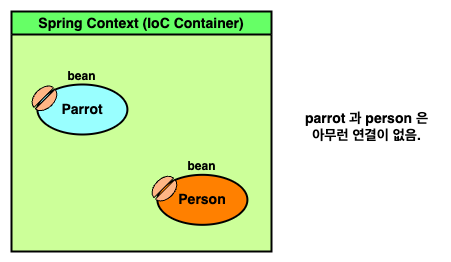
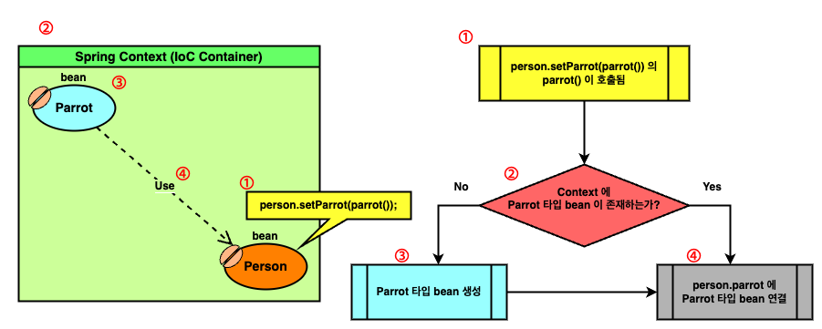

# Chapter 3 : The Spring context : Wiring beans

---

3 장 section 들

- 3.1 Implementing relationship among beans defined In the configuration file
    - 3.1.1 Wiring the beans using a direct method call between the @Bean
    - 3.1.2 Wiring the beans using the @Bean annotated method's parameter
- 3.2 Using the @Autowired annotation to inject beans
    - 3.2.1 Using @Autowired to inject values through class field
    - 3.2.2 Using @Autowired to inject values through the constructor
    - 3.2.3 Using dependency injection through the setter
- 3.3. Dealing with circular dependencies
- 3.4 Choosing from multiple beans in the Spring context

---

- @Bean 어노테이션으로 연결짓기
  - I. `@Bean` 이 붙은 메서드를 직접 호출하는 방식
  - II. 매개변수로 bean 을 제공하는 방식
- @Autowired 어노테이으로 연결짓기
  - I. 클래스 필드에 사용하는 방식
  - II. 생성자에 사용하는 방식
  - III. Setter 에 사용하는 방식
- bean 연결시 주의사항
  - bean scope
  - bean 간의 순환 의존 관계
- Choosing from multiple beans in the Spring context 

---

이번 챕터에서는 bean 간의 관계를 설정하는 법에 대해 알아본다.

저번 챕터에서 우리는 context 에 bean 을 등록시키고, `getBean()` 메서드를 이용해 이를 제공받았다. 그런데 Java 같은 객체지향적 언어에서 종종 개체간 종속적인 관계가 필요할 때가 있다.

```java
class A {}

class B {       // B has instance of an A
    A instance;
}
```

위 같은 상황에서 오직 `getBean` 메서드만 이용한다면 다음처럼 이용해야 한다.

```java
A a = context.getBean(A.class);
B b = context.getBean(B.class);

b.setInstance(a);
```

하지만 위 방식은 우리가 직접 `b` 에 `a` 를 주입하는 것이기에, 버그가 많이 발생할 수 있고, 유지보수가 낮은 boilerplate 코드를 생성할 수 있다.

그럼 이를 어떻게 해결할 수 있을까? 애초에 위 과정을 프레임웍이 대신 해주면 안되나?

스프링은 **_"bean 연결짓기" (Wiring beans)_** 를 통해 이를 해결한다. 

우리가 bean 간의 관계를 명시하고 이를 context 에 적재하면, 스프링은 그 의존관계를 파악해 자동으로 주입시키는 기능을 가지고 있다.

이를 통해 우리는 (다시한번) 스프링에게 제어권을 위임하고 더 안전한 코드를 생성할 수 있다.

---

## `@Bean` 어노테이션으로 연결짓기

`@Bean` 어노테이션으로 연결짓는 방법은 크게 2 가지 방법이 존재한다.
- `@Bean` 이 붙은 메서드를 **직접 호출**하는 방식
- **매개변수**로 bean 을 제공하는 방식

---

### I. `@Bean` 이 붙은 메서드를 **직접 호출**하는 방식

`@Bean` 어노테이션을 이용해 bean 을 선언하려면 스프링 설정 클래스가 필요하다.

```java
@Configuration
public class UnWiredConfig {
  @Bean
  Parrot parrot() {
    Parrot parrot = new Parrot();
    parrot.setName("un-wired parrot");
    return parrot;
  }

  @Bean
  Person person() {
    Person person = new Person();
    person.setName("un-wired person");
    return person;
  }
}
```
```java
var context 
        = new AnnotationConfigApplicationContext(
        UnWiredConfig.class
);

Parrot parrot = context.getBean(Parrot.class);
Person person = context.getBean(Person.class);

System.out.println(parrot);
System.out.println(person);
```
```
Parrot : un-wired parrot
Person : un-wired person, null
```

위 예시의 `UnWiredConfig` 의 `parrot` 과 `person` 은 아무런 연결점이 없다. 때문에 `person` 의 `parrot` 또한 `null` 로 출력되는 것을 볼 수 있다.

<!-- bean_annot_direct_method_1.png -->

<p align="center">
  
</p>

하지만 아래 예시처럼 사용해 이 둘의 의존성을 만들 수 있다.
```java
@Configuration
public class WiredConfig {
    @Bean
    Parrot parrot() {
        Parrot parrot = new Parrot();
        parrot.setName("wired parrot");
        return parrot;
    }

    @Bean
    Person person() {
        Person person = new Person();
        person.setName("wired person");

        // wire bean via direct method call
        person.setParrot(parrot());
        return person;
    }
}
```
```java
var context 
        = new AnnotationConfigApplicationContext(
        UnWiredConfig.class
);

Parrot parrot = context.getBean(Parrot.class);
Person person = context.getBean(Person.class);

System.out.println(parrot);
System.out.println(person);
```
```
Parrot : wired parrot
Person : wired person, Parrot : wired parrot
```

<!-- bean_annot_direct_method_2.png -->

<p align="center">
  
</p>

위 다이어그램은 일반적으로 스프링이 bean 을 연결시키는 과정을 서술한다.

이는 일반적으로 스프링이 bean 관계를 연결지을 때도 적용되는데, 정리하자면 아래와 같다.

1. bean 간의 연결관계를 파악한다.
2. 연결지을 bean 이 존재하는지 확인 한다.
3. 연결지을 bean 이 존재하지 않으면 해당 bean 을 생성한다.
4. 생성 혹은 존재하는 bean 을 연결짓는다.

이를 위 예시에 적용하면,

1. `person` bean 생성 시 `person.setParrot(parrot())` 의 `parrot()` 이 호출된다.
2. 스프링은 context 내 `parrot()` 과 동일한 bean 이 있는지 탐색한다.
3. 존재하지 않는다면 `parrot()` 에 해당하는 bean 을 생성한다.
4. 생성 혹은 context 에 존재하던 bean 을 `person.setParrot(...)` 에 제공한다.

와 같이 정리할 수 있다.

---

### II. **매개변수**로 bean 을 제공하는 방식

매개변수로 bean 을 제공해 연결짓는 방식은 사실 따져보면 앞의 과정과 동일하다.

```java
@Configuration
public class Config {
    @Bean
    Parrot parrot() {
        Parrot parrot = new Parrot();
        parrot.setName("Param Parrot");
        return parrot;
    }

    @Bean
    Person person(Parrot p) {
        Person person = new Person();
        person.setName("Param Person");
        person.setParrot(p);
        return person;
    }
}
```
```java
var context 
        = new AnnotationConfigApplicationContext(
        Config.class
);

Parrot parrot = context.getBean(Parrot.class);
Person person = context.getBean(Person.class);

System.out.println(parrot);
System.out.println(person);
```
```
Parrot : Param Parrot
Person : Param Person, Parrot : Param Parrot
```

매개변수로 제공되는 방식은 `@Bean` 이 붙은 `person` 메서드에 `Parrot p` 인자가 존재한다.

앞서 _direct method call_ 방식과 동일하게, 위 `person` bean 이 생성될 때, 스프링은 context 에 `Parrot` 타입의 bean 이 존재하는지 확인한다.

이 때 만약 존재하지 않으면 생성해 메서드 인자로 제공한다.

때문에 사실 _direct method call_ 방식과 _method parameter_ 방식은 우리의 사용 방법이 다를 뿐, 스프링 입장에서는 모두 동등한 방식이다.

---

## `@Autowired` 어노테이션으로 연결짓기

앞서 `@Bean` 어노테이션을 사용해 연결짓는 방식을 보았다.

하지만 bean 이 `@Bean` 으로 선언되지 않고 `@Component` 같은 스테레오타입 방식으로 선언되었을 수도 있다.

이러한 경우 `@Autowired` 어노테이션을 이용해 스테레오타입 방식의 bean 을 연결지을 수 있다.

해당 방식은 `@Autowired` 를 어디에 사용하는지에 따라 크게 3 가지 방식으로 나뉜다.
- 클래스 필드에 사용하는 방식
- 생성자에 사용하는 방식
- Setter 에 사용하는 방식

이들의 사용법은 정말 방식 이름 그대로 사용하면 된다.

이들 각각의 예시를 보이면 다음과 같다.

---

<details><summary> 클래스 필드에 사용하는 방식</summary>

```java
import org.springframework.beans.factory.annotation.Autowired;

@Component
public class Person {
    private String name = "field person";

    @Autowired // inject dependency on field
    private Parrot parrot;

    public String getName() {
        return name;
    }

    public void setName(String name) {
        this.name = name;
    }

    public Parrot getParrot() {
        return parrot;
    }

    public void setParrot(Parrot parrot) {
        this.parrot = parrot;
    }

    @Override
    public String toString() {
        return "Person : " + name + ", " + parrot;
    }
}
```
```java
var context 
        = new AnnotationConfigApplicationContext(
        Config.class
);

Parrot parrot = context.getBean(Parrot.class);
Person person = context.getBean(Person.class);

System.out.println(parrot);
System.out.println(person);
```
```
Parrot : field parrot
Person : field person, Parrot : field parrot
```

</details>

<details><summary> 생성자에 사용하는 방식</summary>

```java
import org.springframework.beans.factory.annotation.Autowired;

@Component
public class Person {
    private String name = "const person";
    
    // parrot can be final with constructor injection
    private final Parrot parrot;

    @Autowired  // inject dependency on constructor
    public Person(Parrot parrot) {
      this.parrot = parrot;
    }

    public String getName() {
        return name;
    }

    public void setName(String name) {
        this.name = name;
    }

    public Parrot getParrot() {
        return parrot;
    }

    @Override
    public String toString() {
        return "Person : " + name + ", " + parrot;
    }
}
```
```java
var context 
        = new AnnotationConfigApplicationContext(
        Config.class
);

Parrot parrot = context.getBean(Parrot.class);
Person person = context.getBean(Person.class);

System.out.println(parrot);
System.out.println(person);
```
```
Parrot : const parrot
Person : const person, Parrot : const parrot
```

</details>

<details><summary> Setter 에 사용하는 방식</summary>

```java
import org.springframework.beans.factory.annotation.Autowired;

@Component
public class Person {
    private String name = "setter person";
    
    private Parrot parrot;

    public String getName() {
        return name;
    }

    public void setName(String name) {
        this.name = name;
    }

    public Parrot getParrot() {
        return parrot;
    }
    
    @Autowired  // inject dependency on setter
    public void setParrot(Parrot parrot) {
        this.parrot = parrot;
    }

    @Override
    public String toString() {
        return "Person : " + name + ", " + parrot;
    }
}
```
```java
var context 
        = new AnnotationConfigApplicationContext(
        Config.class
);

Parrot parrot = context.getBean(Parrot.class);
Person person = context.getBean(Person.class);

System.out.println(parrot);
System.out.println(person);
```
```
Parrot : setter parrot
Person : setter person, Parrot : setter parrot
```

</details>

교재는 이 중 생성자에 사용하는 방식을 권장한다. 생성자에 `@Autowired` 를 이용하면 주입되는 bean 을 `final` 로 설정할 수 있기 때문이다.

```java
@Component
public class Person {
    // parrot can be final with constructor injection
    private final Parrot parrot;

    @Autowired  // inject dependency on constructor
    public Person(Parrot parrot) {
        this.parrot = parrot;
    }
    
    /* ... */
}
```

<details><summary> bean wiring 의 자세한 내막</summary>

그런데 스프링이 bean 을 연결시키는 과정이 살짝 의아할 수 있다.

스프링이 bean 간 관계를 연결시켜주는 건 알겠는데, 이것이 스프링에 어떻게 구현되었으며, 어떻게 가능하냐는 것이다.

사실 이는 스프링의 강력한 기능 중 하나인 **_"관점" (Aspect)_** 을 이용한 것으로, 스프링은 자신이 관리하는 개체의 메서드 호출에 관여할 수 있기 때문에 가능하다.

더 자세히 말하자면 우리가 스프링에게 제공받는 개체는 **정확히 해당 개채가 아니라 아주 비슷한 _모방품 (Proxy)_** 이며, 이로 인해 메서드 호출에 관여할 수 있다.

```java
// a real entity we implemented
class RealEntity    {
    void methodA()  {}
}

// spring gives ProxyEntity instead of RealEntity
class ProxyEntity   {   
    RealEntity entity;
    
    void methodA()  {
        /* ... */
        entity.methodA();
        /* ... */
    }
}
```

우리는 bean 으로 등록할 개체 `RealEntity` 를 정의하고, 스프링은 이를 인지해 `RealEntity` 와 유사한 `ProxyEntity` 를 bean 으로서 제공한다.

그래서 우리가 bean 을 제공받고 `entity.methodA()` 를 호출해도, 사실 `ProxyEntity.methodA` 가 호출되는 것이고, 이로 인해 스프링은 메서드 호출을 가로채는 것이다.

</details>

---

## bean 연결 시 주의사항

앞서 `@Bean`, `@Autowired` 를 이용해 bean 을 연결짓는 방법을 확인하였다.

하지만 bean 들을 연결할 때 유의해야 할 사항들이 존재한다.

---

### I. bean 의 scope

해당 내용은 사실 _5 장 : Bean scope and life cycle_ 에 자세한 설명이 존재한다.

Bean 의 scope 는 쉽게 말해 **_bean 을 제공할 방식_** 이라 말할 수 있다.

스프링은 개발자의 의도에 따라, context 에서 bean 을 요구할 때 **_매번 같은 개체 (Singleton)_** 또는 **_매번 새로운 개체 (Prototype)_** 를 제공할 수 있다.

```java
@Configuration
public class Config {

    @Bean
    Parrot parrot() {
        Parrot parrot = new Parrot();
        parrot.setName("I am parrot");
        return parrot;
    }

    @Bean
    Person person1(Parrot p)    {
        Person person = new Person();
        person.setParrot(p);
        person.setName("First person");
        return person;
    }

    @Bean
    Person person2(Parrot p)    {
        Person person = new Person();
        person.setParrot(p);
        person.setName("Second person");
        return person;
    }
}
```
```java
void showProperties(Object... objs) {
    Arrays.stream(objs)
          .map(o -> String.format("[%s] \t: 0x%8x",
                                  o.getClass().getSimpleName(),
                                  System.identityHashCode(o)))
          .forEach(System.out::println);
}

var context
        = new AnnotationConfigApplicationContext(
        Config.class
);

Parrot beanParrot = context.getBean(Parrot.class);
Person person1 = context.getBean("person1", Person.class);
Person person2 = context.getBean("person2", Person.class);

System.out.println(beanParrot);
System.out.println(person1);
System.out.println(person2);

System.out.println();
showProperties(person1, person2);

System.out.println();
showProperties(beanParrot, person1.getParrot(), person2.getParrot());
```
```
Parrot : I am parrot
Person : First person, Parrot : I am parrot
Person : Second person, Parrot : I am parrot

[Person] 	: 0x2a4fb17b
[Person] 	: 0x7c7b252e

[Parrot] 	: 0x4d5d943d
[Parrot] 	: 0x4d5d943d
[Parrot] 	: 0x4d5d943d
```

위처럼 `System.identityHashcode` 를 이용해 각 bean 의 JVM 구별용 hashCode 를 확인해보면 놀라운 사실을 알 수 있다.

`person1` 과 `person2` 가 분명히 다른 객체임에도 불구하고, 각각의 `.parrot` 이 `beanParrot` 개체인 것을 확인할 수 있다.

이처럼 나타나는 이유는 스프링 bean 의 기본 scope 는 `singleton` 이기 때문이다.

Bean scope 가 `singleton` 으로 설정되면 **스프링은 매 bean 제공마다 동일한 개체를 제공**한다.

때문에 `Config` 의 `Person person1(...)`, `Person person2(...)` 메서드의 `Parrot p` 는 모두 동일한 개체가 제공되어 위와 같은 결과가 나타나는 것이다.

하지만 만약 아래처럼 scope 를 prototype 으로 설정하면 각각 다른 개체인 것을 확인할 수 있다.

```java
import org.springframework.beans.factory.config.BeanDefinition;

@Configuration
public class Config {
    @Bean
    @Scope(BeanDefinition.SCOPE_PROTOTYPE)
    Parrot parrot() {
        Parrot parrot = new Parrot();
        parrot.setName("I am parrot");
        return parrot;
    }
    
    /* ... */
}
```
```
Parrot : I am parrot
Person : First person, Parrot : I am parrot
Person : Second person, Parrot : I am parrot

[Person] 	: 0x 7b2bbc3
[Person] 	: 0x3270d194

[Parrot] 	: 0x235834f2
[Parrot] 	: 0x5656be13
[Parrot] 	: 0x4218d6a3
```

---

### II. 순환 의존관계

우리가 bean 으로 정의하는 개체간 순환 의존관계가 존재할 시, 다음처럼 에러가 발생할 수 있다.

```java
@Component
public class Parrot {
    private String name;
    private Person person;

    @Autowired
    public Parrot(Person person) {
        this.person = person;
    }
    
    /* ... */
}
```
```java
@Component
public class Person {
    private String name;
    private Parrot parrot;

    @Autowired
    public Person(Parrot parrot) {
        this.parrot = parrot;
    }
    
    /* ... */
}
```
```java
var context 
        = new AnnotationConfigApplicationContext(
        Config.class
);
```
```
Exception in thread "main" org.springframework.beans.factory.UnsatisfiedDependencyException:
    ... Requested bean is currently in creation: Is there an unresolvable circular reference?
```

위 코드를 보면 `Parrot` 은 `Person` 을, `Person` 을 `Parrot` 을 필요하는 순환 의존관계임을 볼 수 있다.

이를 해결하는 방법은 다양하자민 교재는 애초에 순환 관계를 갖지 않도록 재설계하는 것을 권장하고 있다.

---

### III. `@Qualifier` 와 `@Primary`

앱을 개발하다보면 종종 같은 타입이지만 다른 속성을 가진 여러 개체가 필요할 수 있다.

교재는 이 때 `@Qualifer` 또는 `@Primary` 를 이용해 여러 bean 을 구별하거나 주 bean 을 설정하길 권장한다.

사실 이에 대한 내용은 이미 2 장에 정리하였으므로 이를 참고하면 될 듯 하다.

---

## Summary

- 앱을 개발하며 종종 한 개체가 다른 개체를 참조해야하는 상황이 발생한다. 이 때 bean 간의 관계를 지어주는 **_bean wiring_** 으로 스프링에게 작업을 넘길 수 있다.
- Bean wiring 은 크게 `@Bean` 어노테이션을 이용하는 방법과 `@Autowired` 어노테이션을 이용하는 방법이 있다. 특히 `@Autowired` 는 스테레오타입 어노테이션을 이용할 때 유용하다.
- `@Bean` 어노테이션을 이용하는 bean wiring 은 다음 2 가지 방법이 있다.
  - `@Bean` 이 붙은 메서드를 직접 호출하는 방식 **_(Direct method call)_**
  - 매개변수로 bean 을 제공하는 방식 **_(Supply bean via method parameter)_**
- `@Autowired` 어노테이션을 이용하는 bean wiring 은 다음 3 가지 방법이 있다.
  - 필드에 주입하는 방식
  - 생성자에 주입하는 방식
  - Setter 에 주입하는 방식
- `@Autowired` 방식 중 **생성자에 주입하는 방식** 은 `final` 키워드를 사용할 수 있어 선호된다.
- Bean wiring 시 다음 3 가지 사항을 유의해야 한다.
  - Bean scope 에 따른 singleton, prototype bean
  - 순환 의존관계 **_(Circular dependency)_**
  - `@Qualifier`, `@Primary` 를 이용해 bean 구별 및 선정하기
- 스프링이 bean 을 연결지을 때, 기본적으로 현재 context 에 동일시 될 수 있는 bean 을 찾아 연결한다.
- Bean wiring 은 **_관점 (Aspect)_** 기술을 바탕으로 이뤄진다. 때문에 우리가 제공받는 bean 은 **_모종품 (Proxy)_** 이다.
