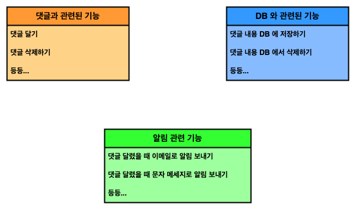
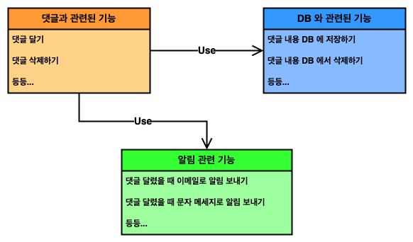
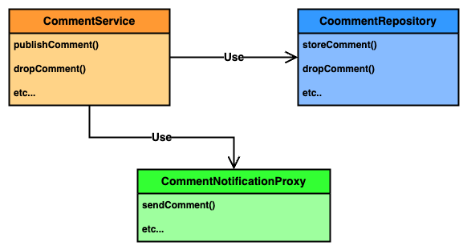
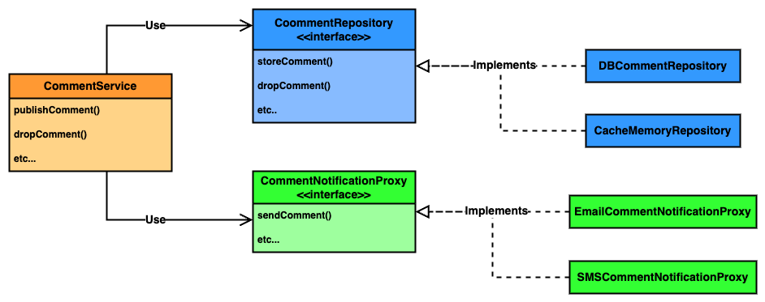
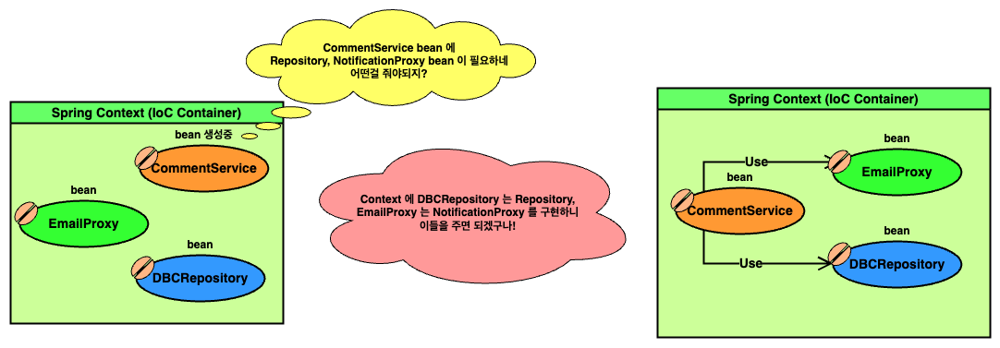

# Chapter 4 : The Spring context : Using abstractions

---

4 장 section 들

- 4.1 Using interfaces to define contracts
    - 4.1.1 Using interfaces for decoupling implementation
    - 4.1.2 Implementing the requirement without using a framework
- 4.2 Using dependency injection with abstractions
    - 4.2.1 Deciding which object should be part of the Spring context
    - 4.2.2 Choosing what to auto-wire multiple implementations of an abstraction
- 4.3 Focusing on object responsibilities with stereotype annotations

---


---

이번 챕터에서는 **_추상화 (Abstraction)_** 된 bean 을 이용하는 예시를 구체적으로 설명한다.

추상화란 **_"어느 시스템의 기반을 담당하는 과정 등을 일반화하고 뭉뚱그려, 더 효율적으로 수행하기 위한 방법론"_** 으로 Java 는 **추상 클래스**, **interface** 등의 문법으로 추상화 기능을 제공한다.

추상화를 통해 우리는 여러 기능을 목적에 따라 묶고 상황에 따라 알맞게 구현할 수 있으며, 이를 통해 유지보수성이 높은 코드를 작성할 수 있다.

때문에 개발자는 추상화를 빈번히 이용하는데, 스프링 bean 또한 추상화가 이뤄질 수 있다.

---

## 문제 상황 제시

교재는 다음과 같은 문제 상황을 제시한다.

- 당신은 팀 작업을 관리하기 위해 사용하는 앱을 개발하고 있다.
- 앱의 주 기능 중 하나는 사용자가 작업에 대한 의견 (댓글) 을 남기는 기능이다.
- 사용자가 댓글을 남기면 이를 DB 등 어딘가에 저장하고, 앱은 작업을 게시한 사용자에게 이메일 등의 알림을 보낸다.

정리하면 어느 게시글에 댓글이 작성되면 게시글 작성자에게 (이메일 등의) 알림을 보내는 기능을 구현하는 상황이다.

---

## 문제 설계

문제를 해결하기 전, 문제에 필요한 기능들과 요구 기능에 따른 책임들 (responsibilities) 를 구별해 보자.

우선 게시글에 댓글을 다는 기능이 필요하다. 또한 댓글을 달았을 때 해당 정보를 저장하는 기능, 그리고 게시글 작성자에게 이메일을 보내는 기능이 필요할 것이다.

이들을 보면 각 기능들을 다음처럼 분류할 수 있다.

<!-- responsibilities_1.png -->

<p align="center">
  
</p>

또한 생각해보면 우리는 **"댓글이 달렸을 때 DB 에 내용을 저장하고, 사용자에게 알림을 주고 싶으므로"** 아래와 같은 의존관계를 생각할 수 있다.

<!-- responsibilities_2.png -->

<p align="center">
  
</p>

그런데 현업 개발에서는 종종 **_어떤 기능의 필수 부가결한 코드, 논리 등_** 을 **_비즈니스 로직 (Business Logic)_** 이라 칭하고, 비즈니스 로직 등을 포함하여 **_사용자의 요구를 만족시키는 개체_** 를 **_서비스 (Service)_** 라고 부른다.

또한 실제 앱과 DB 사이에 존재하며, 앱의 데이터 CRUD 작업을 DB 에 전달할 수 있는 개체를 **_Repository_** 또는 **_DAO (Data Access Object)_**, 앱 외부와 통신하는 역할을 가진 개체를 **_Proxies_** 라 부른다.

때문에 이를 활용해 다이어그램을 현실에 가깝게 만들면 다음처럼 보일 수 있다.

<!-- responsibilities_3.png -->

<p align="center">
  
</p>

여기서 한번 생각해보자. 

`CommentRepository` 는 앱과 DB 사이에 존재해 필요한 기능을 `CommentService` 에 제공한다. 하지만 만약 우리가 사용하는 DB 가 바뀔 수 있고 심지어 DB 를 사용하지 않는다면 어떨까?

또한 문제 상황에서는 게시글 작성자에게 이메일 알림을 보내기로 했지만 문자 메시지, 혹은 다른 알림을 보낸다면 어떨까?

만약 우리가 위 다이어그램 그대로 구현을 마쳤다면, **각 요구상황에 맞춰 또다른 개체를 설계, 구현** 해야 한다.

때문에 우리는 추후 유지보수와 개발성을 생각해 `CommentRepository`, `CommentNotificationProxy` 의 책임을 한단계 추상화 한다.

<!-- responsibilities_4.png -->

<p align="center">
  
</p>

위 과정으로 우리는 기능 구현에 필요한 설계를 마쳤다. 마지막으로 하나 언급하지 않은 내용이 있는데, 바로 **댓글** 그 자체이다.

우리가 댓글을 작성할 때, `CommentService` 는 그 댓글의 내용이 담긴 어떤 개체를 Repository, Proxy 로 보내주어야 한다.

현업에서 이처럼 **_각 부품에게 정보를 제공하기 위한 개체_** 를 **_Model_** 또는 **_DTO (Data Transfer Object)_** 라 칭한다.

우리의 **댓글** 은 그 자체가 사용자의 로직에 관여하거나 하지 않고, 단지 `CommentService` 에서 `CommentRepository` 혹은 `CommentNotificationProxy` 로 전달될 뿐이므로 **Model** 로 분류할 수 있다.

이제 이에 따라서 모든 추상체와 구현체를 작성하면 아래와 같다.

```
without_spring
├── models
│   └── Comment.java
├── proxies
│   ├── CommentNotificationProxy.java
│   └── EmailCommentNotificationProxy.java
├── repositories
│   ├── CommentRepository.java
│   └── DBCommentRepository.java
├── services
│   └── CommentService.java
└── Main.java
```

<details><summary> 세부 코드</summary>

---

<details><summary> models/Comment.java</summary>

---

```java
package practice.without_spring.models;

public class Comment {
    private String author;
    private String text;

    public String getAuthor() {
        return author;
    }

    public void setAuthor(String author) {
        this.author = author;
    }

    public String getText() {
        return text;
    }

    public void setText(String text) {
        this.text = text;
    }
}
```

---

</details>

<details><summary> proxies</summary>

---

- `CommentNotificationProxy.java`

  ```java
  package practice.without_spring.proxies;

  import practice.without_spring.models.Comment;
  
  public interface CommentNotificationProxy {
    void sendComment(Comment comment);
  }
  ```

- `EmailCommentNotificationProxy.java`
  ```java
  package practice.without_spring.proxies;
  
  import practice.without_spring.models.Comment;
  
  public class EmailCommentNotificationProxy implements CommentNotificationProxy {
    @Override
    public void sendComment(Comment comment) {
      System.out.println("Sending notification for comment : " + comment.getText());
    }
  }
  ```

---

</details>

<details><summary> repositories</summary>

---

- CommentRepository

  ```java
  package practice.without_spring.repositories;
  
  import practice.without_spring.models.Comment;
  
  public interface CommentRepository {
      void storeComment(Comment comment);
  }
  ```

- DBCommentRepository

  ```java
  package practice.without_spring.repositories;
  
  import practice.without_spring.models.Comment;
  
  public class DBCommentRepository implements CommentRepository {
      @Override
      public void storeComment(Comment comment) {
          System.out.println("Storing comment : " + comment.getText());
      }
  }
  ```

---

</details>

<details><summary> services/CommentService.java</summary>

---

```java
package practice.without_spring.services;

import practice.without_spring.models.Comment;
import practice.without_spring.proxies.CommentNotificationProxy;
import practice.without_spring.repositories.CommentRepository;

public class CommentService {
    private final CommentRepository repo;
    private final CommentNotificationProxy notificationProxy;

    public CommentService(CommentRepository repo, CommentNotificationProxy notificationProxy) {
        this.repo              = repo;
        this.notificationProxy = notificationProxy;
    }

    public void publishComment(Comment comment) {
        repo.storeComment(comment);
        notificationProxy.sendComment(comment);
    }
}

```

---

</details>

---

</details>

세부 구현한 내용을 간단히 말하자면 각 작업이 수행될 때마다 콘솔 (`System.out`) 에 이를 출력하도록 만들었다.

그래서 아래처럼 실행하면 실행된 작업이 출력됨을 볼 수 있다.

```java
CommentRepository repo 
        = new DBCommentRepository();
CommentNotificationProxy notificationProxy 
        = new EmailCommentNotificationProxy();

CommentService service 
        = new CommentService(repo, notificationProxy);

Comment comment = new Comment();
comment.setAuthor("Anonymous");
comment.setText("My First Comment!");

service.publishComment(comment);
```
```
Storing comment : My First Comment!
Sending notification for comment : My First Comment!
```

---

## Spring 을 얹어보자

앞서 `CommentService` 를 인스턴스화 하는 부분을 다시 보자.

```java
CommentRepository repo 
        = new DBCommentRepository();
CommentNotificationProxy notificationProxy 
        = new EmailCommentNotificationProxy();

CommentService service 
        = new CommentService(repo, notificationProxy);
```

스프링을 이용하지 않으면 위처럼 우리가 직접 `repo` 와 `notificationProxy` 를 `CommentService` 의 생성자에 제공해야 한다.

이를 스프링을 이용해 바꿔보자.

편의를 위해 스테레오타입 어노테이션을 이용하자. 
```java
@Component
public class DBCommentRepository 
        implements CommentRepository {
    /* ... */
}
```
```java
@Component
public class EmailCommentNotificationProxy 
        implements CommentNotificationProxy {
    /* ... */
}
```
```java
@Component
public class CommentService {
    private final CommentRepository repo;
    private final CommentNotificationProxy notificationProxy;

    @Autowired
    public CommentService(
            CommentRepository repo, 
            CommentNotificationProxy notificationProxy
    ) {
        this.repo              = repo;
        this.notificationProxy = notificationProxy;
    }
    
    /* ... */
}
```
```java
@Configuration
@ComponentScan  
// If specific packages are not defined, 
// scanning will occur recursively 
// beginning with the package of the class 
// that declares this annotation.
public class Config {}
```

위 코드를 보면 한가지 눈에띄는 사항이 존재한다.

분명 우리는 `@Component` 어노테이션을 `DBCommentRepository`, `EmailCommentNotificationProxy` **구현체**에 붙였다.

하지만 `CommentService` 에는 `CommentRepository`, `CommentNotificationProxy` 를 이용해 `@Autowired` 가 사용됨을 볼 수 있다.

이처럼 사용해도 에러가 나지 않는 이유는 스프링이 bean wiring 을 진행할 때, 필요한 bean 의 타입을 추론하기 때문이다.

<!-- with_spring_1.png -->
<p align="center">
  
</p>

즉, 우리가 평소 스프링이 없던것 처럼 개발해도 스프링은 똑똑하게 잘 알아들을 수 있다는 것이다.

때문에 위처럼 어노테이션을 붙인 후, 아래처럼 실행할 수 있다.

```java
var context
        = new AnnotationConfigApplicationContext(Config.class);

CommentService service 
        = context.getBean(CommentService.class);

Comment comment = new Comment();
comment.setAuthor("Anonymous");
comment.setText("Comment with Spring!");

service.publishComment(comment);
```
```
Storing comment : Comment with Spring!
Sending PUSH notification for comment : Comment with Spring!
```

물론 스프링 bean wiring 을 이용하는 것이기에, 만약 context 에 `CommentRepository` 등을 구현한 개체가 다수 존재하면 `@Primary`, `@Qualifier` 등을 이용해 명확히 지시해야 한다.

---

## `@Service`, `@Repository` 어노테이션

우리는 앞서 **'게시글에 댓글을 다는 기능'**, **'댓글의 정보를 저장하는 기능'** 등을 성격에 따라 **_Service_**, **_Repository_** 로 분류했다.

하지만 정작 우리가 스프링을 이용할 때는 `@Component` 어노테이션만 이용하였고, 이는 개발자의 의도가 감춰지는 결과로 이어질 수 있다.

스프링은 이를 위해 `@Service`, `@Repository` 등의 어노테이션을 제공한다.

이들은 모두 `@Component` 와 동일하게 스테레오타입 어노테이션들이고, 기본적으로 `@Component` 와 동일한 역할을 수행한다.

때문에 교재는 이들을 이용해 자신의 의도를 더 명확히 하는 것을 권장한다.

---

## Summary
- 추상화를 통해 기능을 구분짓는건 설계에 있어서 중요한 요소 중 하나이다.
- 스프링은 똑똑해서 추상화 된 bean 을 wiring 할 때, 적절히 추론하여 연결시켜 준다.
- 이전 bean wiring 에서와 동일하게, context 에 bean 이 많아질수록 `@Qualifier`, `@Primary` 를 잘 활용하자.
- 자신의 의도를 잘 나타낼 수 있도록 `@Service`, `@Repository` 어노테이션을 잘 활용하자.

