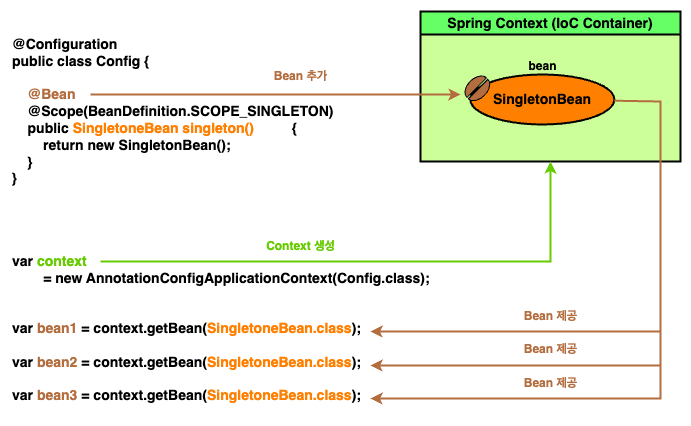
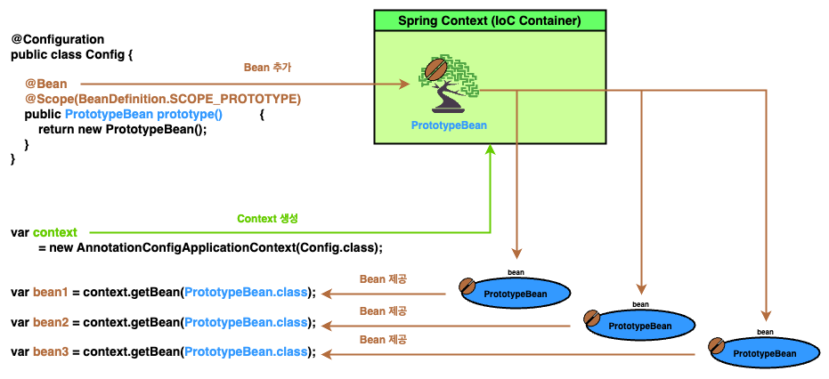
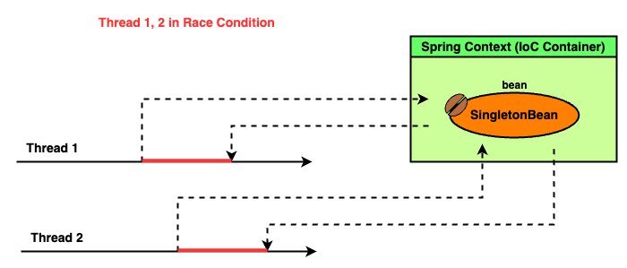
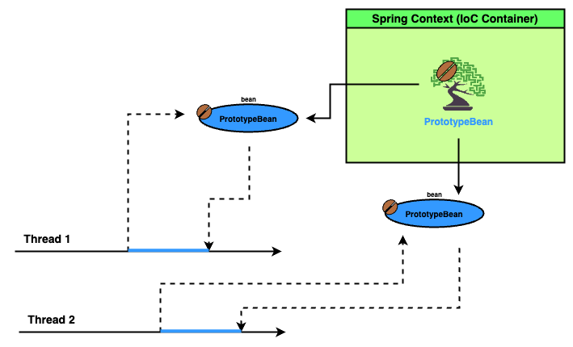

# Chapter 5 : The Spring context : Bean scopes and life cycle

---

지금까지 스프링이 개체를 관리하는데 필수 지식들을 알아보았다. (Context 에 bean 을 등록하고 bean 간의 연결관계를 설립하는 방법 등)

하지만 정작 bean 이 정확히 언제, 어떻게 생성되는지에 대한 언급은 없었고, 단지 프레임웍의 기본 접근 방식만 의존하였다.

때문에 이번 챕터에서는 bean 이 관리되는 방식을 총칭하는 **_Bean Scope_** 와 그들의 종류에 대해 알아본다.

---

## Bean Scope

프로그래밍에서 **_Scope_** 란 **_어느 변수가 유효성을 갖는 영역_** 을 지칭하며, 이는 변수의 가시성, 수명을 표현할 때 유용하다. [`[1]`](#reference)

```java
{
    // scope of `val` is local variable
    // visibility of `val` is bounded with {...} area
    // lifetime of `val` is with {...} area
    int val = 10;
    System.out.println(val);
}

System.out.println(val);
```

때문에 **_Bean Scope_** 는 **_Bean 의 가시성, 수명을 지칭하기 위한 단어_** 이며, 스프링은 특히 bean 수명에 초점을 두어 크게 2 가지 scope 로 bean 을 분류한다.

- **_Singleton Bean Scope_ (default)**
- **_Prototype Bean Scope_**

---

## Singleton Bean Scope

**_Singleton Bean Scope_** 는 이름 그대로 bean 을 **Singleton** 으로 관리하고 제공함을 나타내는 scope 이다.

이 때 singleton 은 디자인 패턴의 **_Singleton Pattern_** [`[2]`](#reference) 을 의미하고, 때문에 우리가 아무리 많이 bean 을 요구하여도 항상 같은 bean 을 제공한다.

```java
import org.springframework.context.annotation.Scope;
import org.springframework.beans.factory.config.BeanDefinition;

@Configuration
public class Config {
    @Bean
    @Scope(BeanDefinition.SCOPE_SINGLETON)
    public SingletonBean singleton() {
        return new SingletonBean();
    }
}

class SingletonBean {}
```
```java
void showProperties(Object... objs) {
    Arrays.stream(objs)
          .map(o -> String.format("[%s] \t: 0x%8x",
                  o.getClass().getSimpleName(),
                  System.identityHashCode(o)))
          .forEach(System.out::println);
}

var context
        = new AnnotationConfigApplicationContext(
        Config.class
);

SingletonBean bean1 = context.getBean(SingletonBean.class);
SingletonBean bean2 = context.getBean(SingletonBean.class);
SingletonBean bean3 = context.getBean(SingletonBean.class);

showProperties(bean1, bean2, bean3);
```
```
[SingletonBean] 	: 0x223191a6
[SingletonBean] 	: 0x223191a6
[SingletonBean] 	: 0x223191a6
```

Bean 의 scope 는 `@Scope` 에 scope 이름을 제공해 결정할 수 있다.

(`BeanDefinition` 인터페이스의 `SCOPE_SINGLETON` 상수도 확인해보면 결국 `String SCOPE_SINGLETON = ... = "singleton"` 으로 선언되어 있다.)

<!-- singleton_scope_1.png -->

<p align="center">
  
</p>

Singleton Scope 는 bean scope 의 기본 값으로, 굳이 `@Scope(BeanDefinition.SCOPE_SINGLETON)`를 붙이지 않아도 singleton scope 로 지정된다.

교재는 이러한 특징을 살려 Singleton bean 을 **_그저 단일 bean_** 이라 서술한다. 우리가 매번 bean 을 요구할 때, context 에 존재하는 bean 을 참조하여 제공하는 것이다.

<details><summary> Singleton Bean 의 eager / lazy instantiation</summary>

대부분의 상황에서 singleton scope bean 은 스프링 context 가 초기화 될 때 바로 생성되고, 이를 **_열정적인 인스턴스화 (Eager Instantiation)_** 라고 부른다.

하지만 반대로 bean 이 요구되었을 때 생성되는 방식이 있는데, 이를 **_게으른 인스턴스화 (Lazy Instantiation)_** 라고 부른다.

```java
import org.springframework.context.annotation.Lazy;

@Configuration
public class Config {
    @Bean
    @Scope(BeanDefinition.SCOPE_SINGLETON)
    @Lazy
    public SingletonBean singleton() {
        return new SingletonBean();
    }
}

class SingletonBean {}
```
```java
var context
        = new AnnotationConfigApplicationContext(Config.class);

for (String names : context.getBeanDefinitionNames())
    System.out.println(names);

SingletonBean bean = context.getBean(SingletonBean.class);

System.out.println("------------------------------");
for (String names : context.getBeanDefinitionNames())
    System.out.println(names);
```
```
org.springframework.context.annotation.internalConfigurationAnnotationProcessor
org.springframework.context.annotation.internalAutowiredAnnotationProcessor
org.springframework.context.event.internalEventListenerProcessor
org.springframework.context.event.internalEventListenerFactory
config
------------------------------
org.springframework.context.annotation.internalConfigurationAnnotationProcessor
org.springframework.context.annotation.internalAutowiredAnnotationProcessor
org.springframework.context.event.internalEventListenerProcessor
org.springframework.context.event.internalEventListenerFactory
config
singleton
```

위 코드를 보면 context 가 초기화 되었을 땐 `singleton` bean 이 없는 반면, 해당 빈을 요구한 후에는 존재하는 것을 볼 수 있다.

대부분의 상황에선 Eager Instantiation 방식을 선호한다. Lazy 방식은 항상 bean 을 제공하기 전, 해당 bean 이 현재 생성되어 존재하는지 확인해야 하기 때문이다.

때문에 실행 시간에 대해선 Eager 방식이 Lazy 보다 앞선다.

하지만 그렇다고 Lazy 방식이 쓸모없는 것은 아닌데, 앱의 메모리 사용량을 낮출 수 있기 때문이다.

Lazy 방식으로 singleton bean 을 선언하면 해당 bean 이 필요할 때 개체가 생성되므로 Eager 방식보다 메모리 사용량이 낮다.

이는 특히 **_Monolithic_** 한 앱 구조에서 유용한데, monolithic application 은 그 구조의 특성상 메모리 부담이 클 수 있기 때문이다.

따라서 스프링은 각자의 판단에 따라 singleton scope 를 Eager, Lazy 하게 인스턴스화 할 수 있도록 하고 있다.

</details>

---

## Prototype Bean Scope

Singleton bean 은 매 요구마다 동일한 개체를 제공했다. 반면 **_Prototype Scope Bean_** 은 **_요구마다 새로운 개체_** 를 제공한다.


```java
import org.springframework.context.annotation.Scope;
import org.springframework.beans.factory.config.BeanDefinition;

@Configuration
public class Config {
    @Bean
    @Scope(BeanDefinition.SCOPE_PROTOTYPE)
    public PrototypeBean prototype()    {
        return new PrototypeBean();
    }
}

class PrototypeBean {}
```
```java
void showProperties(Object... objs) {
    Arrays.stream(objs)
          .map(o -> String.format("[%s] \t: 0x%8x",
                                  o.getClass().getSimpleName(),
                                  System.identityHashCode(o)))
          .forEach(System.out::println);
}

var context
        = new AnnotationConfigApplicationContext(
        Config.class
);

var bean1 = context.getBean(PrototypeBean.class);
var bean2 = context.getBean(PrototypeBean.class);
var bean3 = context.getBean(PrototypeBean.class);

showProperties(bean1, bean2, bean3);
```
```
[PrototypeBean] 	: 0x59662a0b
[PrototypeBean] 	: 0x2f9f7dcf
[PrototypeBean] 	: 0x747ddf94
```

때문에 교재는 prototype scope bean 을 **_Bean 나무_** 로 서술한다.

우리가 bean 을 요구할 때, 스프링은 **_"해당 나무의 bean 을 하나 떼어내 제공"_** 한다고 비유한다.

<!-- prototype_scope_1.png -->

<p align="center">
  
</p>

---

## Bean Scopes in real-world

지금까지 Bean Scope 종류인 Singleton, Prototype Scope 를 살펴보았다.

이들은 각자 어떤 곳에 사용될까?

---

### Singleton Bean Scope in real-world scenarios

Singleton Scope 를 사용하면 bean 으로 제공되는 개체는 모두 동일하기에, 해당 bean 은 앱의 여러 구성 요소에서 사용할 수 있다.

즉, 하나의 개체 인스턴스가 공유된다는 것이고, 때문에 Singleton Scope 는 **_변하지 않을 (Immutable) 개체_** 에 사용되어야 한다.

아래의 그림을 보자.

<!-- singleton_scope_in_real_1.png -->

<p align="center">
  
</p>

위 그림을 보면 스레드 1, 2 가 `SingletonBean` 을 사용하며, 사용하는 시기가 겹치는 것을 볼 수 있다.

이처럼 공유된 자원을 둘 이상의 소비자가 동시에 사용해 의도치 않은 결과가 나올 수 있는 상황을 **_Race Condition_** 혹은 **_Race Hazard_** 라 부른다. [`[3]`](#reference)

Singleton scope 는 모두 동일한 bean 을 제공하므로 멀티 스레드 환경에서 Race Condition 을 만들 수 있다.

때문에 Singleton Scope bean 은 주로 앱의 중추 클래스 설계를 정의할 때, 혹은 개체간 책임 (responsibility) 을 위임할 때 사용된다.

물론 가변적인 개체를 singleton scope 로 사용할 수 없다는 건 아니다.

다만 멀티 스레드 같은 환경에서 정상적으로 수행하려면 해당 bean 을 concurrent 하게 개발자가 잘 만들어야 할 것이다.

---

### Prototype Bean Scope in real-world scenarios

반면 Prototype Scope 은 **_가변적인 (mutable) 개체_** 에 사용하기 좋다.

<!-- prototype_scope_in_real_1.png -->

<p align="center">
  
</p>

앞서 singleton scope 는 한 자원을 동시에 점유할 수 있어 Race Condition 이 발생하였지만, Prototype Scope 는 매 요청마다 새로운 개체를 제공하므로 Race Condition 이 발생하지 않는다.

사실 현업에서 Prototype Bean 이 많이 사용되진 않는다. 왜냐하면 애초에 어느 상태 (state) 를 가진 개체면 굳이 bean 으로 등록시킬 이유가 없기 때문이다.

물론 이는 개발자 본인의 선택이고 합리적인 이유가 있다면 사용을 꺼려하지 말아야 한다.

---

## Summary

- **_Bean Scope_** 는 bean 의 가시성, 수명 등을 지칭하는 용어이며, 크게 **_Singleton, Prototype Scope_** 가 존재한다.
- Singleton Scope bean 은 매 요구마다 동일한 개체를 제공한다.
- Prototype Scope bean 은 매 요구마다 새로운 개체를 생성해 제공한다.
- Singleton Scope bean 은 context 화 초기 즉시 **_(Eager)_** 혹은 bean 요구 당시 **_(Lazy)_** 생성될 수 있다.
- Singleton scope 의 특성상, singleton scope 은 immutable 한 개체에 주로 사용된다. 만약 mutable 한 개체에 사용된다면 **_교착상태 (Race Condition, Race Hazard)_** 에 빠지지 않도록 concurrent 하게 잘 만들어야 한다.
- 반면 mutable 한 개체를 사용할 때, 개체를 Prototype scope bean 으로 만드는 것이 좋을 수도 있다.
- Singleton scope bean 에 Prototype scope bean 의존성이 있을 경우 조심하자.

---

## Reference

- [`[1] : Scope(computer science) - Wikepedia`](https://en.wikipedia.org/wiki/Scope_(computer_science))

- [`[2] : Singleton pattern - Wikepedia`](https://en.wikipedia.org/wiki/Singleton_pattern)

- [`[3] : Race condition - Wikepedia`](https://en.wikipedia.org/wiki/Race_condition)
