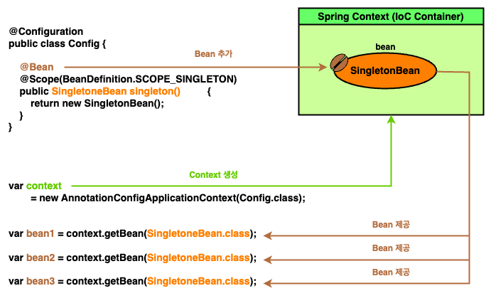

# Chapter 5 : The Spring context : Bean scopes and life cycle

---

5 장 section 들

- 5.1 Using the singleton bean scope
    - 5.1.1 How singleton beans work
    - 5.1.2 Singleton beans in real-world
    - 5.1.3 Using eager and lazy instantiation
- 5.2 Using the prototype bean scope
    - 5.2.1 How prototype beans work
    - 5.2.2 Prototype beans in real-world

---

지금가지 스프링이 개체를 관리하는데 필수 지식들을 알아보았다. (Context 에 bean 을 등록하고 bean 간의 연결관계를 설립하는 방법 등)

하지만 정작 bean 이 정확히 언제, 어떻게 생성되는지에 대한 언급은 없었고, 단지 프레임웍의 기본 접근 방식만 의존하였다.

때문에 이번 챕터에서는 bean 이 관리되는 방식을 총칭하는 **_Bean Scope_** 와 그들의 종류에 대해 알아본다.

---

## Bean Scope

프로그래밍에서 **_Scope_** 란 **_어느 변수가 유효성을 갖는 영역_** 을 지칭하며, 이는 변수의 가시성, 수명을 표현할 때 유용하다. [`[1]`](#reference)

```java
{
    // scope of `val` is local variable
    // visibility of `val` is bounded with {...} area
    // lifetime of `val` is with {...} area
    int val = 10;
    System.out.println(val);
}

System.out.println(val);
```

때문에 **_Bean Scope_** 는 **_Bean 의 가시성, 수명을 지칭하기 위한 단어_** 이며, 스프링은 특히 bean 수명에 초점을 두어 크게 2 가지 scope 로 bean 을 분류한다.

- **_Singleton Bean Scope_ (default)**
- **_Prototype Bean Scope_**

---

## Singleton Bean Scope

**_Singleton Bean Scope_** 는 이름 그대로 bean 을 **Singleton** 으로 관리하고 제공함을 나타내는 scope 이다.

이 때 singleton 은 디자인 패턴의 **_Singleton Pattern_** [`[2]`](#reference) 을 의미하고, 때문에 우리가 아무리 많이 bean 을 요구하여도 항상 같은 bean 을 제공한다.

```java
import org.springframework.context.annotation.Scope;
import org.springframework.beans.factory.config.BeanDefinition;

@Configuration
public class Config {
    @Bean
    @Scope(BeanDefinition.SCOPE_SINGLETON)
    public SingletonBean singleton() {
        return new SingletonBean();
    }
}

class SingletonBean {}
```
```java
void showProperties(Object... objs) {
    Arrays.stream(objs)
          .map(o -> String.format("[%s] \t: 0x%8x",
                  o.getClass().getSimpleName(),
                  System.identityHashCode(o)))
          .forEach(System.out::println);
}

var context
        = new AnnotationConfigApplicationContext(
        Config.class
);

SingletonBean bean1 = context.getBean(SingletonBean.class);
SingletonBean bean2 = context.getBean(SingletonBean.class);
SingletonBean bean3 = context.getBean(SingletonBean.class);

showProperties(bean1, bean2, bean3);
```
```
[SingletonBean] 	: 0x223191a6
[SingletonBean] 	: 0x223191a6
[SingletonBean] 	: 0x223191a6
```

Bean 의 scope 는 `@Scope` 에 scope 이름을 제공해 결정할 수 있다. 

(`BeanDefinition` 인터페이스의 `SCOPE_SINGLETON` 상수도 확인해보면 결국 `String SCOPE_SINGLETON = ... = "singleton"` 으로 선언되어 있다.)

<!-- singleton_scope_1.png -->

<p align="center">
  
</p>

Singleton Scope 는 bean scope 의 기본 값으로, 굳이 `@Scope(BeanDefinition.SCOPE_SINGLETON)`를 붙이지 않아도 singleton scope 로 지정된다.

교재는 이러한 특징을 살려 Singleton bean 을 **_그저 단일 bean_** 이라 서술한다. 우리가 매번 bean 을 요구할 때, context 에 존재하는 bean 을 참조하여 제공하는 것이다.

<details><summary> Singleton Bean 의 eager / lazy instantiation</summary>

[//]: # (TODO_IMP 싱글토에서 eager / lazy 인스턴스화 가능하다는 내용 추가 필요.)

</details>

---

## Prototype Bean Scope

Singleton bean 은 매 요구마다 동일한 개체를 제공했다. 반면 **_Prototype Scope Bean_** 은 **_요구마다 새로운 개체_** 를 제공한다.


```java
import org.springframework.context.annotation.Scope;
import org.springframework.beans.factory.config.BeanDefinition;

@Configuration
public class Config {
    @Bean
    @Scope(BeanDefinition.SCOPE_PROTOTYPE)
    public PrototypeBean prototype()    {
        return new PrototypeBean();
    }
}

class PrototypeBean {}
```
```java
void showProperties(Object... objs) {
    Arrays.stream(objs)
          .map(o -> String.format("[%s] \t: 0x%8x",
                                  o.getClass().getSimpleName(),
                                  System.identityHashCode(o)))
          .forEach(System.out::println);
}

var context
        = new AnnotationConfigApplicationContext(
        Config.class
);

var bean1 = context.getBean(PrototypeBean.class);
var bean2 = context.getBean(PrototypeBean.class);
var bean3 = context.getBean(PrototypeBean.class);

showProperties(bean1, bean2, bean3);
```
```
[PrototypeBean] 	: 0x59662a0b
[PrototypeBean] 	: 0x2f9f7dcf
[PrototypeBean] 	: 0x747ddf94
```

때문에 교재는 prototype scope bean 을 **_Bean 나무_** 로 서술한다.

우리가 bean 을 요구할 때, 스프링은 **_"해당 나무의 bean 을 하나 떼어내 제공"_** 한다고 비유한다.

<!-- prototype_scope_1.png -->

<p align="center">
  
</p>

---

## Bean Scopes in real-world

[//]: # (TODO_IMP 싱글톤은 immutable 한 개체, 상황일 때 좋고 prototype 은 mutable 할 때 좋은거 + 예시 필요)

---

## Summary

[//]: # (todo_imp 요약 필요)

---

## Reference

- [`[1] : Scope(computer science) - Wikepedia`](https://en.wikipedia.org/wiki/Scope_(computer_science))

- [`[2] : Singleton pattern - Wikepedia`](https://en.wikipedia.org/wiki/Singleton_pattern)