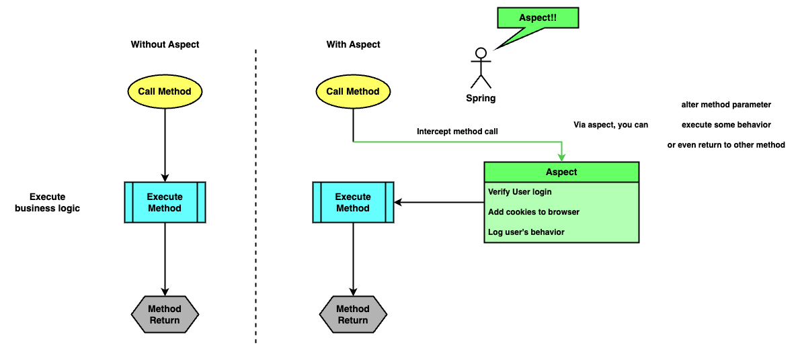
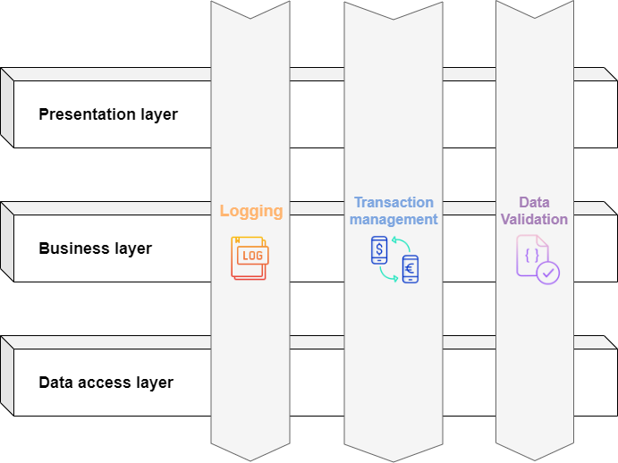
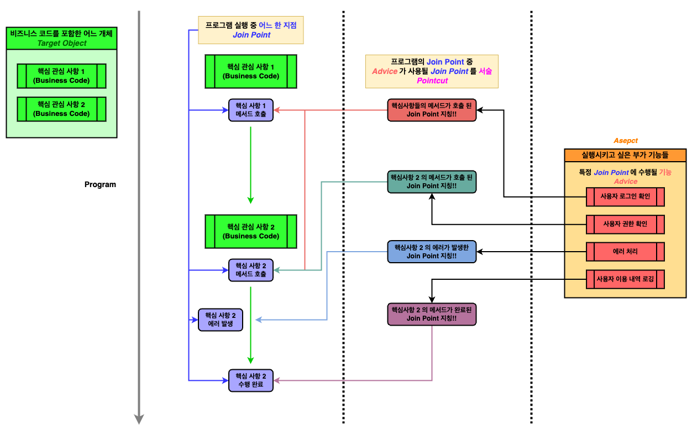
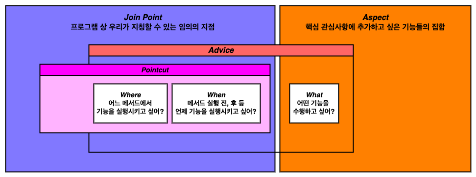

# [Spring Starts Here] - Chapter 6 : Using aspects with Spring AOP

---

지금까지 우리가 알아본 스프링의 기능은 **_DI (Dependency Injection)_** 이었다.

스프링 context 에 우리가 원하는 개체를 넣어두고, 이들의 의존 관계를 `@Autowired` 를 이용해 스프링이 맺어주었다.

이번 챕터에서는 스프링의 또다른 핵심 기능인 **_관점 (Aspect)_** 에 대해서 알아본다.

---

## Spring Aspect?

Aspect 는 스프링이 메서드 호출, 실행을 가로챌 수 있는 방법이다.

Aspect 로 메서드 호출 시점에 개입하여 특정 조건의 로그 남기기 같은 기능을 추가할 수 있고, 심지어 실행되는 메서드를 다른것으로 대체할 수도 있다.

때문에 aspect 는 실행되는 메서드의 특정 로직을 추출할 수 있고, 이로 인해 비즈니스 로직을 훨씬 간결하게 할 수 있다.

<!-- aspect_1.png -->

<p align="center">
  
</p>

Aspect 는 많은 곳에 사용될 수 있지만, 그 중 가장 빈번하고 중요히 사용되는 부분은 **_트랜잭션성 (Transactionality) 과 보안 (Security)_** 일 것이다.

앱에서 DB 등의 **_퍼시스턴스 계층 (Persistence Layer)_** 이 존재하고 이들의 입출력 작업을 수행할 때, 우리는 항상 데이터의 **트랜잭션성** 을 보수해야 한다.

쉽게 말해 친구에게 500 원을 송금하다 인터넷이 끊어졌을 때, 그 500 원은 다시 나에게 돌아와야지 사라지면 안된다는 것이다.

스프링에서는 `@Transactional` 어노테이션을 사용해 메서드의 트랜잭션성을 보장할 수 있고, 이 기능의 근본적 원리는 aspect 로 메서드를 가로채는 원리이다.

보안의 경우 앱의 특정 서비스를 제공하지 전, 사용자 인증 또는 권한을 확인해야 할 경우가 존재한다. 이러한 기능을 aspect 를 이용하여 비즈니스 코드와 분리시켜 간결한 코드를 작성할 수 있다.

---

## Essential of Aspect-Oriented Programming (AOP)

우리는 결국 aspect 를 이용해 코드를 간결하게 만들 수 있고, 우리의 주요 관심사항에 여러 부가 기능을 끼워넣을 수 있다.

이처럼 주요 관심 사항 _**(Core Concerns)**_ 에 다른 관심 사항을 _**교차시켜 공통된 관심사항 (Cross-cutting Concerns)**_ 으로 프로그래밍 하는 방식을 _**관점 지향 프로그래밍 (AOP, Aspect-Oriented Programming)**_ 이라 부른다.

<!-- aop_methodology_cross_cutting_concerns.png -->

<p align="center">
   <br>
 <a href="https://saigontechnology.com/blog/an-introduction-to-aspect-oriented-programming">An Introduction to Aspect-Oriented Programming - SAIGON TECHNOLOGY Blog</a>
</p>

하지만 이를 직접 사용하기 전, AOP 와 관련된 용어들을 정리하고, 그에 관한 개념을 익히는 것이 먼저이다. [`[1]`](#reference), [`[2]`](#reference)

|       `Name`        | `Description`                                                                                                                                                                                                                                           |
|:-------------------:|---------------------------------------------------------------------------------------------------------------------------------------------------------------------------------------------------------------------------------------------------------|
|    **_Aspect_**     | 핵심 관심사항에 부가적으로 적용시키고 싶은 로직들의 집합. **_(Modularization of a concern)_**                                                                                                                                                                                    |
|  **_Join Point_**   | 프로그램 실행 중 에러 처리, 메서드 실행 등 지칭할 수 있는 어느 한 지점. **_(Point during the execution of a program)_** <br/>(+ Spring-aop 의 경우 항상 메서드 호출 지점)                                                                                                                       |
|    **_Advice_**     | 특정 _Join Point_ 에 수행되고 싶은 행동을 지칭하는 단어로, 어느 메서드 실행 직전 _**(Before)**_, 실행 전 후 _**(Around)**_ 등의 실행되고픈 _Join Point_ 정보 또한 포함된다. <br> (ex : A 메서드 _**(Where)**_ 실행 전 _**(when)**_ 에 어떤 기능 _**(what)**_ 이 수행되었으면 한다 --> _**(Were + When + What) = Advice**_) |
|   **_Pointcut_**    | 프로그램의 _Join Point_ 중 **_"서술된 Join Point" (A predicate that matches join points)_** 로, 어느 _Advice_ 가 프로그램의 어떤 _Join Point_ 에 _**(Where + When)**_ 사용되어야 하는지 나타낸다. <br/>(스프링은 기본적으로 **_AspectJ Pointcut_** 방식의 _Pointcut_ 표현 방식을 사용함)                     |
| **_Target Object_** | _Aspect_ 가 적용되는 개체                                                                                                                                                                                                                                      |

<!-- aop_terminology_1.png -->
<p align="center">

  
</p>

위 단어들은 Spring-aop 에만 사용되는 단어가 아닌, AOP 에서 통용되는 단어들이다.

때문에 스프링 aspect 를 이용하기 전, 위 개념들을 반드시 알고 있는 것이 좋다.

---

### _**Join Point**_

_Join Point_ 는 프로그램 실행 중 우리가 지칭할 수 있는 임의의 한 지점이다. 통상적인 AOP 의 _Join Point_ 는 ~~(설명 그대로)~~ 우리가 지칭만 할 수 있으면 모두 _Join Point_ 라 할 수 있다.

```java
// Before initializing some local variable  
// --> This can be a Join Point

int someValue = 10;     // Initializing local variable
// --> This can be also a Join Point!

System.out.println(someValue);  
// After calling System.out.println method
// --> And this can be Join Point!!
```

하지만 스프링 AOP 의 경우 기본적으로 _**Proxy Pattern**_ 을 기반으로 aop 를 적용시키기 때문에, **스프링의 _Join Point_ 는 항상 메서드 호출 부근**을 지칭한다.

---

### _**Aspect**_ 와 _**Advice**_

_Aspect_ 는 핵심 관심사항에 적용시키고 싶은 로직들의 집합으로, 다수의 관심 사항을 그 종류와 특성에 맞춰 분류할 수 있다.

또한 _Advice_ 는 **특정 _Join Point (At a particular Join Point)_ 에** 부가적으로 적용시키고 싶은 **행동 _(Action)_** 으로, 사실 **행동과 실행 위치, 시점을 모두 포함하는 개념** 이다.

---

### _**Pointcut**_

_Pointcut_ 은 _Join Point_ 의 일종으로, 프로그램 상 모든 _Join Point_ 중 우리의 _Aspect_ 가 개입된 _Join Point_ 를 지칭한다.

이는 _Advice_ 와 유사하게 **실행 위치와 시점** 을 포함하는 개념으로, 이 둘의 차이점은 우리가 지시하는 **행동** 이 포함되는지 이다.

---

위 개념들을 정리해서 나타내면 다음과 같다.

<!-- aop_terminology_2.png -->
<p align="center">
  
</p>

AOP 는 결국 프로그램 내 우리가 원하는 지점들에 관심사항을 끼워넣는 것일 뿐, 전혀 어려운 개념이 아니다.

---

## Spring-AOP, how it works? - The Proxy

그렇다면 스프링은 내부적으로 어떻게 작동하길래 이런 AOP 가 가능한 것일까?

이는 사실 이전 챕터에서 언급한 적이 있듯이, 스프링이 제공하는 bean 은 **정확히 해당 개체가 아니라 모방품 _(Proxy)_** 일 수 있기 때문이다.

다음 예시를 통해 자세히 알아보자.

<details><summary> [자세한 코드...]</summary>

```java
class NormalBean {}

class AdvisedBean {
   public void someMethodToIntercepted() {}
}

@Aspect
@Component
class SomeAspect {
   @Around("execution(* AdvisedBean.*())")
   public Object around(ProceedingJoinPoint joinPoint) throws Throwable {
      return joinPoint.proceed();
  }
}

@Configuration
@EnableAspectJAutoProxy
@ComponentScan
public class Config {
    @Bean
    @Lazy
    public NormalBean normalBean() {
        NormalBean bean = new NormalBean();
        showIdentity(bean);
        return bean;
    }
  
    @Bean
    @Lazy
    public AdvisedBean advisedBean() {
        AdvisedBean bean = new AdvisedBean();
        showIdentity(bean);
        return bean;
    }
  
    public static void showIdentity(Object o) {
        System.out.printf("[%s] \t: 0x%08x\n", 
            o.getClass().getSimpleName(), 
            System.identityHashCode(o));
    }
}
```

</details>

```java
var context 
        = new AnnotationConfigApplicationContext(
        Config.class
);

NormalBean normalBean = context.getBean(NormalBean.class);
Config.showIdentity(normalBean);

System.out.println();
AdvisedBean advisedBean = context.getBean(AdvisedBean.class);
Config.showIdentity(advisedBean);
```
```
[NormalBean] 	: 0x2dfaea86    // identity of real object
[NormalBean] 	: 0x2dfaea86    // idnetity of object provided by spring context

[AdvisedBean] 	: 0x69c81773    // We expect THIS object will be provided by spring context
[AdvisedBean$$SpringCGLIB$$0] 	: 0x3e62d773  // BUT IT'S NOT! IT'S PROXY!!
```

위 코드를 보면 `System.identityHashcode` 로 각 개체의 정확한 _identity_ 를 확인하고 있다.

`Config` 클래스에 bean 으로 제공할 개체의 identity 를 확인하고, context 에서 제공받은 bean 의 identity 를 확인하고 있다.

따라서 위 코드는 결국 **스프링에 등록되는 개체와 제공받는 개체가 동일한지 확인하는** 목적이다.

그런데 출력에서 볼 수 있듯, `NormalBean` 은 동일하지만 `AdvisedBean` 은 다른것을 볼 수 있다!

기본적으로 스프링은 context 에 bean 이 등록될 때 _(runtime)_, **해당 bean 이 Proxy 이어야 하는지 확인한다.**

`NormalBean` 의 경우 Proxy 로 설정되어 제공되어야할 기능이 존재하지 않는다. 때문에 context 에 등록될 때와 bean 으로 제공되었을 때 모두 `0x2dfaea86` 로 동일하다.

하지만 `AdvisedBean` 의 경우 `SomeAspect` 에 의해 존재하는 모든 메서드가 가로채어진다. 때문에 스프링은 `AdvisedBean` bean 을 Proxy 로 제공할 필요성을 느끼고 `AdvisedBean$$SpringCGLIB$$0 : 0x3e62d773` 개체를 bean 으로서 제공하는 것이다.

결국 스프링은 모방품을 bean 으로 제공함으로서 메서드 호출을 가로챌 수 있고, 이를 근간으로 AOP 기술을 실현한다.

> 더불어 스프링의 Proxy 는 `JDK Dynamic Proxy` 를 이용하는 방법과, `CGLIB` 를 이용하는 방법이 있다.
>
> 이들을 아주 간단하게 정리하자면 `JDK Dynamic Proxy` 는 자바의 `Reflection API` 를 이용해 Proxy 를 생성하는 방식이고, `CGLIB` 는 bean 클래스의 _Byte Code_ 를 조작해 Proxy 로 만드는 방식이다.
>
> 더 자세한 설명은 아래 좋은 글이 있으니 이들을 참고하는 것이 좋을 듯 하다. [`[3]`](#reference), [`[4]`](#reference)
>
> 이들에 대한 Spring 공식 문서도 존재한다. [`[5]`](#reference)


[//]: # (TODO_imp 스크림 2/2 내용 추가 필요)

---

## Reference

- [`[1] : AOP Concepts - Spring documentation`](https://docs.spring.io/spring-framework/reference/core/aop/introduction-defn.html)
- [`[2] : Spring AOP: What's the difference between JoinPoint and PointCut? - StackOverflow`](https://stackoverflow.com/questions/15447397/spring-aop-whats-the-difference-between-joinpoint-and-pointcut)
- [`[3] : JDK Dynamic Proxy와 FactoryBean 그리고 ProxyFactoryBean - gmoon92's github.io`](https://gmoon92.github.io/spring/aop/2019/02/23/spring-aop-proxy-bean.html)
- [`[4] : JDK Dynamic Proxy와 CGLIB의 차이점은 무엇일까? - gmoon92's github.io`](https://gmoon92.github.io/spring/aop/2019/04/20/jdk-dynamic-proxy-and-cglib.html)
- [`[5] : Proxying Mechanisms - Spring documentation`](https://docs.spring.io/spring-framework/reference/core/aop/proxying.html)
- [`[6] : 자바 AOP의 모든 것(Spring AOP & AspectJ) - JiwonDev's Tistory`](https://jiwondev.tistory.com/152)