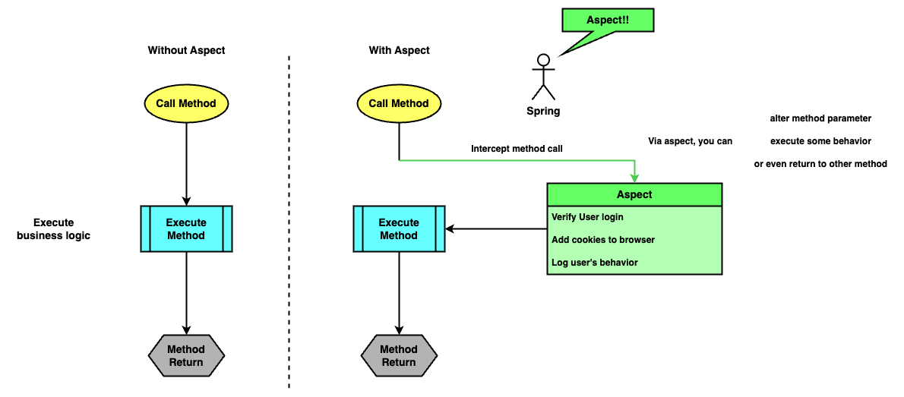

# Chapter 6 : Using aspects with Spring AOP

---

6 장 section 들

- 6.1 How aspects work in Spring
- 6.2 Implementing aspects with Spring AOP
    - 6.2.1 Implementing a simple aspect
    - 6.2.2 Altering the intercepted method's parameters and the returned value
    - 6.2.3 Intercepting annotated methods
    - 6.2.4 Other advice annotation you can use
- 6.3 The aspect execution chain

---

지금까지 우리가 알아본 스프링의 기능은 **_DI (Dependency Injection)_** 이었다.

스프링 context 에 우리가 원하는 개체를 넣어두고, 이들의 의존 관계를 `@Autowired` 를 이용해 스프링이 맺어주었다.

이번 챕터에서는 스프링의 또다른 핵심 기능인 **_관점 (Aspect)_** 에 대해서 알아본다.

---

## Spring Aspect?

Aspect 는 스프링이 메서드 호출, 실행을 가로챌 수 있는 방법이다.

Aspect 로 메서드 호출 시점에 개입하여 특정 조건의 로그 남기기 같은 기능을 추가할 수 있고, 심지어 실행되는 메서드를 다른것으로 대체할 수도 있다.

때문에 aspect 는 실행되는 메서드의 특정 로직을 추출할 수 있고, 이로 인해 비즈니스 로직을 훨씬 간결하게 할 수 있다.

<!-- aspect_1.png -->

<p align="center">
  
</p>

Aspect 는 많은 곳에 사용될 수 있지만, 그 중 가장 빈번하고 중요히 사용되는 부분은 **_트랜잭션성 (Transactionality) 과 보안 (Security)_** 일 것이다.

앱에서 DB 등의 **_퍼시스턴스 계층 (Persistence Layer)_** 이 존재하고 이들의 입출력 작업을 수행할 때, 우리는 항상 데이터의 **트랜잭션성** 을 보수해야 한다.

쉽게 말해 친구에게 500 원을 송금하다 인터넷이 끊어졌을 때, 그 500 원은 다시 나에게 돌아와야지 사라지면 안된다는 것이다.

스프링에서는 `@Transactional` 어노테이션을 사용해 메서드의 트랜잭션성을 보장할 수 있고, 이 기능의 근본적 원리는 aspect 로 메서드를 가로채는 원리이다.

보안의 경우 앱의 특정 서비스를 제공하지 전, 사용자 인증 또는 권한을 확인해야 할 경우가 존재한다. 이러한 기능을 aspect 를 이용하여 비즈니스 코드와 분리시켜 간결한 코드를 작성할 수 있다.

---

## Essential of Aspect-Oriented Programming (AOP)

우리는 결국 aspect 를 이용해 코드를 간결하게 만들 수 있고, 우리의 주요 관심사항에 여러 부가 기능을 끼워넣을 수 있다.

이처럼 주요 관심 사항 _**(Core Concerns)**_ 에 다른 관심 사항을 _**교차시켜 공통된 관심사항 (Cross-cutting Concerns)**_ 으로 프로그래밍 하는 방식을 _**관점 지향 프로그래밍 (AOP, Aspect-Oriented Programming)**_ 이라 부른다.

<!-- aop_methodology_cross_cutting_concerns.png -->

<p align="center">
   <br>
 <a href="https://saigontechnology.com/blog/an-introduction-to-aspect-oriented-programming">An Introduction to Aspect-Oriented Programming - SAIGON TECHNOLOGY Blog</a>
</p>

하지만 이를 직접 사용하기 전, AOP 와 관련된 용어들을 정리하고, 그에 관한 개념을 익히는 것이 먼저이다. [`[1]`](#reference), [`[2]`](#reference)

|       `Name`        | `Description`                                                                                                                                                                                                                                                |
|:-------------------:|--------------------------------------------------------------------------------------------------------------------------------------------------------------------------------------------------------------------------------------------------------------|
|    **_Aspect_**     | 핵심 관심사항에 부가적으로 적용시키고 싶은 로직들의 집합. **_(Modularization of a concern)_**                                                                                                                                                                                         |
|  **_Join Point_**   | 프로그램 실행 중 에러 처리, 메서드 실행 등 지칭할 수 있는 어느 한 지점. **_(Point during the execution of a program)_** <br/>(+ Spring-aop 의 경우 항상 메서드 호출 지점)                                                                                                                            |
|    **_Advice_**     | 특정 _Join Point_ 에 수행되고 싶은 행동을 지칭하는 단어로, 어느 메서드 실행 직전 _**(Before)**_, 실행 전 후 _**(Around)**_ 등의 실행되고픈 _Join Point_ 정보 또한 포함되어 있다. <br> (ex : A 메서드 _**(where)**_ 실행 전 _**(when)**_ 에 어떤 기능 _**(what)**_ 이 수행되었으면 한다. --> _**(Where + When + What) = Advice**_) |
|   **_Pointcut_**    | 프로그램의 _Join Point_ 중 **_"서술된 Join Point" (A predicate that matches join points)_** 로, 어느 _Advice_ 가 프로그램의 어떤 _Join Point_ 에 사용되어야 하는지 나타낸다. <br/>(스프링은 기본적으로 **_AspectJ Pointcut_** 방식의 _Pointcut_ 표현 방식을 사용함)                                               |
| **_Target Object_** | _Advice_ 가 적용되는 개체                                                                                                                                                                                                                                           |

<!-- aop_terminology_1.png -->
<p align="center">

  

[//]: # (TODO_imp 윈도우에서 draw.io 그림 폰트 이상해짐. 맥북에서 고쳐야 됨. ㅅㅂ)
</p>

위 단어들은 Spring-aop 에만 사용되는 단어가 아닌, AOP 에서 통용되는 단어들이다.

때문에 스프링 aspect 를 이용하려면 위 개념들을 반드시 알고 있어야 한다.

---

### _**Join Point**_

_Join Point_ 는 프로그램 실행 중 우리가 지칭할 수 있는 임의의 한 지점이다. 통상적인 AOP 의 _Join Point_ 는 설명 그대로 우리가 지칭만 할 수 있으면 모두 _Join Point_ 라 할 수 있다.

```java
// Before initializing some local variable  
// --> This can be a Join Point

int someValue = 10;     // Initializing local variable
// --> This can be also a Join Point!

System.out.println(someValue);  
// After calling System.out.println method
// --> And this can be Join Point!!
```

하지만 스프링 AOP 의 경우 기본적으로 _**Proxy Pattern**_ 을 기반으로 aop 를 적용시키기 때문에, **스프링의 _Join Point_ 는 항상 메서드 호출 부근**을 지칭한다.

---

### _**Aspect**_ 와 _**Advice**_

Aspect 는 핵심 관심사항에 적용시키고 싶은 로직들의 집합으로, ()

### _**Pointcut**_


---

아직 스프링 aspect 에 관해 이야기 하지 않았지만, 먼저 미리보기로 위 내용들을 정리해 나타내면 다음과 같다.

[//]: # (TODO_imp spring-aop & aop terminology 합쳐서 코드 그림으로 보여주기)

---

> ?? `@EnableAspectJAutoProxy` 잘못 붙였는데도 실행 왜 됨???
> https://stackoverflow.com/questions/48625149/spring-aop-works-without-enableaspectjautoproxy
>
> 위 글에선 Spring Boot 일 때 `@SpringBootApplication` 에 섞여있다고 함. 여기까지는 나랑 상관 없는데 `AopAutoConfiguration.java` 보면
> 관련된 `@ConditionalOnClass` 어노테이션에 `Aspect.class` 가 있는 걸 볼 수 있음. `@ConditionalOnClass` 는 특정 class 파일이 존재하면 bean 을 등록하는
> 어노테이션이라고 함.
>
> 그래서 비록 boot 는 아니지만 뭔가 `@ConditionalOnClass` 비슷한 거 때문에 `@Aspect` 어노테이션 붙은 클래스 인식하고 자동으로 `@EnableAspectJAutoProxy` 붙여준
> 듯??


Spring AOP includes the following types of advice:

Before advice: Advice that runs before a join point but that does not have the ability to prevent execution flow
proceeding to the join point (unless it throws an exception).

After returning advice: Advice to be run after a join point completes normally (for example, if a method returns without
throwing an exception).

After throwing advice: Advice to be run if a method exits by throwing an exception.

After (finally) advice: Advice to be run regardless of the means by which a join point exits (normal or exceptional
return).

Around advice: Advice that surrounds a join point such as a method invocation. This is the most powerful kind of advice.
Around advice can perform custom behavior before and after the method invocation. It is also responsible for choosing
whether to proceed to the join point or to shortcut the advised method execution by returning its own return value or
throwing an exception.


---

## Reference

- [`[1] : AOP Concepts - spring documentation`](https://docs.spring.io/spring-framework/reference/core/aop/introduction-defn.html)
- [`[2] : Spring AOP: What's the difference between JoinPoint and PointCut? - StackOverflow`](https://stackoverflow.com/questions/15447397/spring-aop-whats-the-difference-between-joinpoint-and-pointcut)