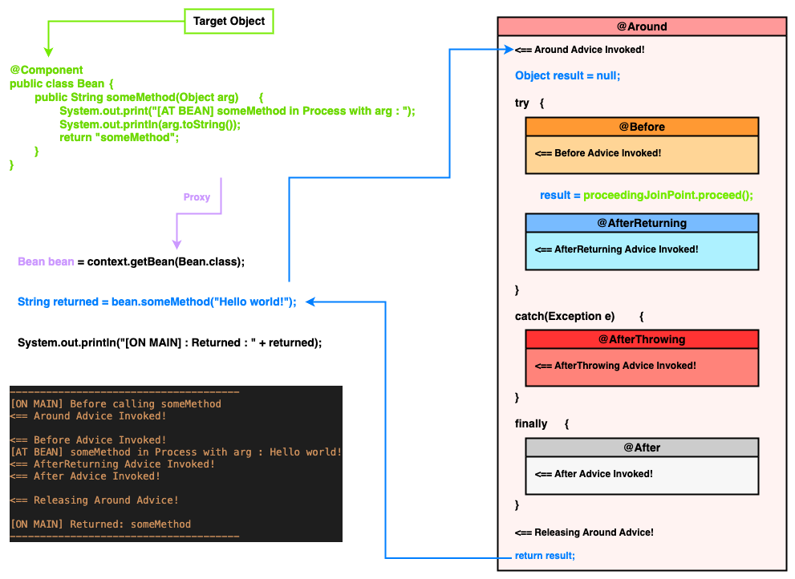
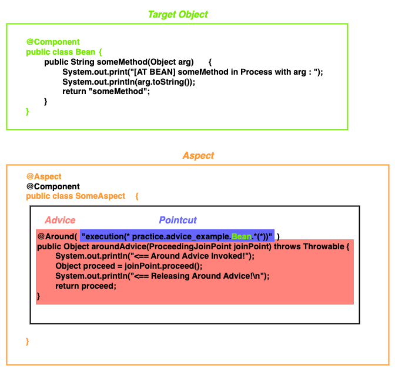

# Chapter 6 : Using aspects with Spring AOP (2/3)

---

이전 글에서는 AOP 에 대한 필수적인 지식과 Spring-aop 가 Proxy 를 이용해 작동하는 것을 알아보았다.

이번 글에서는 스프링에서 사용할 수 있는 Advice 에 대해 알아본다.

---

## Advices in Spring

스프링의 aspect 는 `spring-aspect` 혹은 `aspectj` 관련 라이브러리가 필요하다. (사실 `spring-aspect` 라이브러리가 `aspectjweaver` 라이브러리를 의존하고 있어서 뭐든 비슷하다.)

<!-- spring-aspect_dependency.png -->

<p align="center">
  
</p>

또한 aspect 를 이용하기 위해선 스프링 설정 클래스에 `@EnableAspectJAutoProxy` 를 붙여야 한다.

```java
import org.springframework.context.annotation.EnableAspectJAutoProxy;

@Configuration
@EnableAspectJAutoProxy
@ComponentScan
public class Config {}
```

또한 우리 관심사의 집합인 Aspect 에 해당하는 클래스를 만들어야 하는데, 해당 클래스는 스프링의 bean 이어야 하며 `@Aspect` 어노테이션이 붙어야 한다.

```java
import org.aspectj.lang.annotation.Aspect;

@Aspect
@Component  
// Aspect has to be bean so that spring invoke advice
public class SomeAspect {
    /* ... */
}
```

> `@EnableAspectJAutoProxy` 잘못 붙여도 실행 되던데요??
>
> 스프링 공식 문서를 보면 `@EnableAspectJAutoProxy` 는 스프링 설정 클래스에 붙어야 한다고 적혀있다.
>
> 하지만 찾아본 결과 Spring-boot 에서 `@Aspect` 어노테이션이 붙은 bean 이 발견되면, 스프링이 알아서 `@EnableAspectJAutoProxy` 를 붙여주는 것을 확인했다. [`[1]`](#reference)
>
> 때문에 비록 boot 가 아니지만 위와 비슷한 내부 처리로 스프링이 알아서 붙여주는 것 같다.

스프링은 대표적인 5 종류의 Advice 를 사용할 수 있다. [`[2]`](#reference)

| **Advice**          | **Description**                                                |
|---------------------|----------------------------------------------------------------|
| `@Before`           | 메서드 실행 이전에 실행되고픈 어드바이스                                         |
| `@AfterReturning`   | 메서드가 정상적으로 실행 후, 호출된 곳으로 실행 결과 `(return)` 를 전달하기 전 실행되고픈 어드바이스 |
| `@AfterThrowing`    | 메서드 실행 중 에러가 throw 되었을 때 실행되고픈 어드바이스                           |
| `@After, (finally)` | 메서드 실행 (throw 포함) 후, 실행되고픈 어드바이스 (`try-finally` 와 동치)          |
| `@Around`           | 메서드 실행 이전, 에러 throw 후, 실행 후 등 위 모든 어드바이스 를 포괄할 수 있는 어드바이스      |

이를 직접 확인해보자.

<details><summary> [자세한 코드]</summary>

```java
import org.aspectj.lang.annotation.*;
import org.aspectj.lang.JoinPoint;
import org.aspectj.lang.ProceedingJoinPoint;

@Aspect
@Component
public class SomeAspect {
    @Before("execution(* practice.advice_example.Bean.*(*))")
    public void beforeAdvice(JoinPoint joinPoint) {
        System.out.println("\n<== Before Advice Invoked!");
    }

    @AfterReturning("execution(* practice.advice_example.Bean.*(*))")
    public void afterReturningAdvice(JoinPoint joinPoint) {
        System.out.println("<== AfterReturning Advice Invoked!");
    }

    @AfterThrowing("execution(* practice.advice_example.Bean.*(*))")
    public void afterThrowAdvice(JoinPoint joinPoint) {
        System.out.println("<== AfterThrowing Advice Invoked!");
    }

    @After("execution(* practice.advice_example.Bean.*(*))")
    public void afterAdvice(JoinPoint joinPoint) {
        System.out.println("<== After Advice Invoked!\n");
    }

    @Around("execution(* practice.advice_example.Bean.*(*))")
    public Object aroundAdvice(ProceedingJoinPoint joinPoint) throws Throwable {
        System.out.println("<== Around Advice Invoked!");
        Object proceed = joinPoint.proceed();
        System.out.println("<== Releasing Around Advice!\n");
        return proceed;
    }
}
```

```java
@Component
public class Bean    {
    public String someMethod(Object arg)  {
        System.out.print("[AT BEAN] someMethod in Process with arg : ");
        System.out.println(arg.toString());
        return "someMethod";
    }
}
```

</details>

```java
var context
        = new AnnotationConfigApplicationContext(
        Config.class
);

Bean bean = context.getBean(Bean.class);

System.out.println("--------------------------------------");
System.out.println("[ON MAIN] Before calling someMethod");
try {
    String returned1 = bean.someMethod("given parameter");

    System.out.println("[ON MAIN] Returned: " + returned1);
    System.out.println("--------------------------------------");

    System.out.println("[ON MAIN] Before calling someMethod");
    String returned2 = bean.someMethod(null);

    System.out.println("[ON MAIN] Returned: " + returned2);
}
catch (Exception e) {
    System.out.println("[ON MAIN] Exception occurred in method!");
}

System.out.println("--------------------------------------");
```
```
--------------------------------------
[ON MAIN] Before calling someMethod
<== Around Advice Invoked!

<== Before Advice Invoked!
[AT BEAN] someMethod in Process with arg : given parameter
<== AfterReturning Advice Invoked!
<== After Advice Invoked!

<== Releasing Around Advice!

[ON MAIN] Returned: someMethod
--------------------------------------
[ON MAIN] Before calling someMethod
<== Around Advice Invoked!

<== Before Advice Invoked!
[AT BEAN] someMethod in Process with arg : <== AfterThrowing Advice Invoked!
<== After Advice Invoked!

[ON MAIN] Exception occurred in method!
--------------------------------------
```

---

## `@Before`, `@AfterReturning` Advice

`@Before` 어드바이스는 우리가 지정한 Pointcut 이 실행되기 전에 실행되며, `@AfterReturning` 은 실행 후, 호출된 곳으로 반환값을 전달하기 전 실행된다.

```java
@Before("execution(* practice.advice_example.Bean.*(*))")
public void beforeAdvice() {
    System.out.println("\n<== Before Advice Invoked!");
}

@AfterReturning("execution(* practice.advice_example.Bean.*(*))")
public void afterReturningAdvice() {
    System.out.println("<== AfterReturning Advice Invoked!");
}
```

위 코드를 보면 `... ("execution(* practice.advice_example.Bean.*(*))")` 과 같은 표현식이 있는데, 이는 `AspectJ` 식 Pointcut 표현식으로, 표현식을 잉요해 프로그램상 모든 Join Point 중 특정한 것들을 지칭할 수 있다.

스프링 aspect 는 기본적으로 `AspectJ` 표현식으로 Pointcut 을 지칭하며 메서드의 이름, 메서드의 반환 타입, 심지어 메서드의 인자 타입에 따라 Pointcut 을 추릴 수 있다.

```
--------------------------------------
[ON MAIN] Before calling someMethod

<== Before Advice Invoked!
[AT BEAN] someMethod in Process with arg : given parameter
<== AfterReturning Advice Invoked!

[ON MAIN] Returned: someMethod
--------------------------------------
[ON MAIN] Before calling someMethod

<== Before Advice Invoked!
[AT BEAN] someMethod in Process with arg :

[ON MAIN] Exception occurred in method!
--------------------------------------
```

그래서 위 출력을 보면 `[AT BEAN]` 이 출력되기 전, `<== Before Advice Invoked!` 가 출력되고, `[ON MAIN]` 에서 메서드 반환값인 `someMethod` 가 출력되기 전, `<== After Advice Invoked!` 가 출력되는 것을 볼 수 있다.

또한 메서드 실행 중 에러가 발생했을 때의 경우를 볼수 있는데, `@Before` 의 경우 메서드 호출 직전에 사용되므로 아무 문제 없이 실행된다.

하지만 `@AfterReturning` 은 메서드 도중 에러가 발생하여 결과값을 반환할 수 없고, 위 2번째 출력에서도 보이지 않는 것을 볼 수 있다.

---

## `@AfterThrowing`, `@After` Advice

`@AfterThrowing` 과 `@After` 어드바이스는 그 특징 덕에 종종 `try-catch-finally` 구문과 자쥬 비유된다.

`@AfterThrowing` 어드바이스는 에러가 발생했을 때 실행되고픈 어드바이스로, `try-catch-finally` 중 `catch` 에 비유된다.

반면 `@After` 어드바이스는 메서드가 정상적으로 실행되었든, 에러가 발생하였든 마지막에 항상 실행되고픈 어드바이스로, `finally` 에 비유된다.

```java
@AfterThrowing("execution(* practice.advice_example.Bean.*(*))")
public void afterThrowAdvice() {
    System.out.println("<== AfterThrowing Advice Invoked!");
}

@After("execution(* practice.advice_example.Bean.*(*))")
public void afterAdvice(JoinPoint joinPoint) {
    System.out.println("<== After Advice Invoked!\n");
}

```
```java
@Component
public class Bean    {
    public String someMethod(Object arg)  {
        System.out.print("[AT BEAN] someMethod in Process with arg : ");
        System.out.println(arg.toString());
        return "someMethod";
    }
}

try {
    System.out.println("------------------------------");

    System.out.println("[ON MAIN] Before calling someMethod");
    String returned2 = bean.someMethod(null);

    System.out.println("[ON MAIN] Returned: " + returned2);
}
catch (Exception e) {
    System.out.println("[ON MAIN] Exception occurred in method!");
}

System.out.println("------------------------------");
```

위 코드를 보면 `bean.someMethod(null)` 을 실행하여 의도적으로 `NullPointException` 을 일으키는 것을 볼 수 있다.

해당 상황에 `@AfterThrowing`, `@After` 어드바이스를 적용시켜 생각해보자.

```
--------------------------------------
[ON MAIN] Before calling someMethod

[AT BEAN] someMethod in Process with arg : <== AfterThrowing Advice Invoked!
<== After Advice Invoked!

[ON MAIN] Exception occurred in method!
--------------------------------------
```

본래 원래대로 메서드가 정상 실행되었다면 `[AT BEAN] someMethod in Process with arg : SOME ARG` 처럼 인자로 주어진 파라미터를 출력한다.

하지만 `null` 을 제공하여 에러가 발생하였고 인자가 출력되는 대신 `<== AfterThrowing Advice Invoked!` 가 출력되는 것을 볼 수 있다.

그 이후 메서드 실행 중 에러가 발생했지만 `<== After Advice Invoked!` 가 출력되며 `@After` 어드바이스가 실행되는 것을 볼 수 있다.

---

## `JoinPoint`, `ProceedingJoinPoint` 와 `@Around` Advice

앞서 `@Before`, `@AfterReturning`, `@AfterThrowing`, `@After` 어드바이스를 살펴보았다.

이들은 그 자체로도 Join Point 에 대한 정보를 나타내지만 프로그램상으로 더 자세한 정보를 확인할 수 있다.

```java
private static void showJoinPointProperties(JoinPoint joinPoint) {
    System.out.println("\t -----------------------------------------------------------------------------------------------");
    System.out.println("\t| JoinPoint Info\t----: " + joinPoint + "\t\t|");
    System.out.println("\t|\tJoinPoint Kind\t\t--: " + joinPoint.getKind()+ "\t\t\t\t\t\t\t\t\t\t\t\t\t|");
    System.out.println("\t|\tTarget Object\t\t--: " + joinPoint.getTarget()+ "\t\t\t\t\t\t\t\t|");
    System.out.println("\t|\tMethod Arguments\t--: " + Arrays.toString(joinPoint.getArgs())+ "\t\t\t\t\t\t\t\t\t\t\t\t\t\t\t\t|");
    System.out.println("\t -----------------------------------------------------------------------------------------------");
}

@Before("execution(* practice.advice_example.Bean.*(*))")
public void beforeAdvice(JoinPoint joinPoint) {
    System.out.println("\n<== Before Advice Invoked!");
    showJoinPointProperties(joinPoint);
}

@AfterReturning("execution(* practice.advice_example.Bean.*(*))")
public void afterReturningAdvice(JoinPoint joinPoint) {
    System.out.println("<== AfterReturning Advice Invoked!");
}

@AfterThrowing("execution(* practice.advice_example.Bean.*(*))")
public void afterThrowAdvice(JoinPoint joinPoint) {
    System.out.println("<== AfterThrowing Advice Invoked!");
}

@After("execution(* practice.advice_example.Bean.*(*))")
public void afterAdvice(JoinPoint joinPoint) {
    System.out.println("<== After Advice Invoked!\n");
}
```
```
--------------------------------------
[ON MAIN] Before calling someMethod

<== Before Advice Invoked!
	 -----------------------------------------------------------------------------------------------
	| JoinPoint Info	----: execution(String practice.advice_example.Bean.someMethod(Object))	|
	|	JoinPoint Kind		--: method-execution					        |
	|	Target Object		--: practice.advice_example.Bean@2f666ebb			|
	|	Method Arguments	--: [given parameter]				                |
	 -----------------------------------------------------------------------------------------------
[AT BEAN] someMethod in Process with arg : given parameter
<== AfterReturning Advice Invoked!
<== After Advice Invoked!

[ON MAIN] Returned: someMethod
--------------------------------------
[ON MAIN] Before calling someMethod

<== Before Advice Invoked!
	 -----------------------------------------------------------------------------------------------
	| JoinPoint Info	----: execution(String practice.advice_example.Bean.someMethod(Object))	|
	|	JoinPoint Kind		--: method-execution						|
	|	Target Object		--: practice.advice_example.Bean@2f666ebb		        |
	|	Method Arguments	--: [null]							|
	 -----------------------------------------------------------------------------------------------
[AT BEAN] someMethod in Process with arg : <== AfterThrowing Advice Invoked!
<== After Advice Invoked!

[ON MAIN] Exception occurred in method!
--------------------------------------
```

위 코드처럼 `@Before`, `@AfterReturning`, `@AfterThrowing`, `@After` 어드바이스에 `JoinPoint joinPoint` 인자를 받고, 이를 통해 더 상세한 정보를 확인할 수 있다.

출력을 보면 어드바이스가 적용된 개체 `(Target Object)`, 메서드에 전달된 인자 `(Method Arguments)` 또한 확인할 수 있고, 이들을 이용해 더 자세히 Pointcut 을 설정할 수 있다.

하지만 **`JoinPoint` 인자는 반드시 각 어드바이스의 첫번째 인자로만 가능하다.** 이를 어길 시 `AspectJAdviceParameterNameDiscoverer$AmbiguousBindingException` 으로 인해 context 생성에 실패한다.

```java
package org.aspectj.lang;

public interface JoinPoint {
    String toString();
    
    Object getTarget();
    
    Object[] getArgs();
    
    String getKind();

    Signature getSignature();
    
    /* ... */
}
```

`JoinPoint` 인터페이스는 해당 Join Point 에 대한 정보만 나타낼 뿐, 인자를 가로채 다른 값으로 넣어준다든가, 메서드 실행 그 자체에 관여하지 못한다.

이를 위해 존재하는 것이 `ProceedingJoinPoint` 인터페이스와 `@Around` 어드바이스이다.

```java
package org.aspectj.lang;

public interface ProceedingJoinPoint extends JoinPoint {
    public Object proceed() throws Throwable;

    public Object proceed(Object[] args) throws Throwable;

    /* ... */
}
```

**`ProceedingJoinPoint` 는 오직 `@Around` 어드바이스와 같이 사용될 수 있다.** 다른 어드바이스에 사용시, 라이브러리가 `java.lang.IllegalArgumentException` 를 뱉어내어 context 초기화에 실패한다.

`ProceedingJoinPoint` 인터페이스는 `JoinPoint` 를 상속하여 `proceed` 메서드를 새롭게 구현하였다. 이 `proceed` 메서드를 통해 우리가 직접 메서드 실행 자체에 관여할 수 있다.

물론 `ProceedingJoinPoint` 도 `JoinPoint` 의 일종이므로 **`@Around` 어드바이스의 첫번째 인자로만 사용이 가능**하다.

```java
@Before("execution(* practice.advice_example.Bean.*(*))")
// java.lang.IllegalArgumentException: 
// ProceedingJoinPoint is only supported for around advice
public void beforeAdvice(ProceedingJoinPoint joinPoint) {   
    System.out.println("\n<== Before Advice Invoked!");
    showJoinPointProperties(joinPoint);
}

@Around("execution(* practice.advice_example.Bean.*(*))")
public Object aroundAdvice(ProceedingJoinPoint joinPoint) throws Throwable {
    System.out.println("<== Around Advice Invoked!");
    Object proceed = joinPoint.proceed();
    System.out.println("<== Releasing Around Advice!\n");
    return proceed;
}
```
```
--------------------------------------
[ON MAIN] Before calling someMethod
<== Around Advice Invoked!

<== Before Advice Invoked!
[AT BEAN] someMethod in Process with arg : given parameter
<== AfterReturning Advice Invoked!
<== After Advice Invoked!

<== Releasing Around Advice!

[ON MAIN] Returned: someMethod
--------------------------------------
[ON MAIN] Before calling someMethod
<== Around Advice Invoked!

<== Before Advice Invoked!
[AT BEAN] someMethod in Process with arg : <== AfterThrowing Advice Invoked!
<== After Advice Invoked!

[ON MAIN] Exception occurred in method!
--------------------------------------
```

위 출력을 보면 `bean` 의 메서드를 실행할 `@Around` 어드바이스가 사용되여 `<== Around Advice Invoked!` 가 출력됨을 볼 수 있다.

메서드가 정상 실행된 경우, 호출된 곳으로 되돌아 가기 전, `<== Releasing Around Advice!` 가 출력되며, 에러가 발생한 경우 이가 보이지 않는것을 볼 수 있다.

---

## Summary

지금까지 많은 내용을 설명하였다. 이를 간단히 정리하면 다음과 같다.

- 스프링에서 다음 5 종류의 대표적 어드바이스를 사용할 수 있다.
    - `@Before`, `@AfterReturning`, `@AfterThrowing`, `@After`, `@Around`
- 이 중 `@Around` 는 가장 일반적인 어드바이스로, 첫번째 인자로 `ProceedingJoinPoint` 를 받아 메서드 실행, 인자 변경 등 에 관여할 수 있다.
- `@Around` 를 제외한 어드바이스들은 첫번재 인자로 오직 `JoinPoint` 를 받아, 어드바이스의 Join Point 에 대한 정보를 확인할 수 있다.

<!-- advice_1.png -->

<p align="center">
  
</p>

<!-- advice_2.png -->

<p align="center">

  
</p>

[_(Chapter 6 : Using aspects with Spring AOP (3/3) 에 계속...)_](./script_3.md)

---

## Reference

- [`[1] : Spring AOP works without @EnableAspectJAutoProxy? - StackOverflow`](https://stackoverflow.com/questions/48625149/spring-aop-works-without-enableaspectjautoproxy)